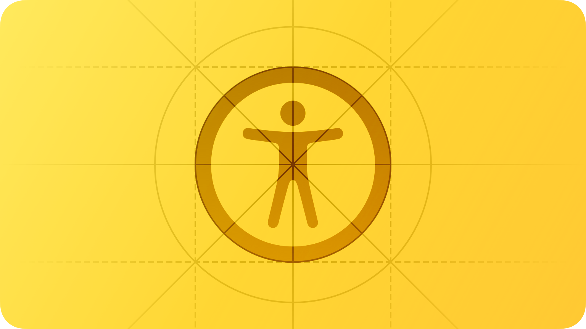
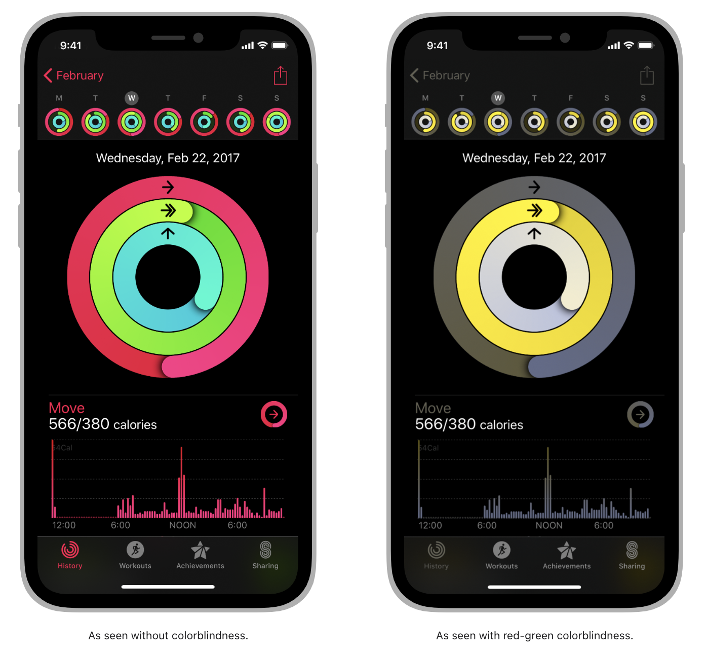
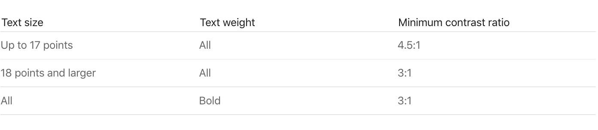

# Accessibility


본 문서는 Apple의 Human Interface Guideline(이하 HIG) 문서를 한글로 번역한 것입니다. iOS 생태계 내에서 HIG를 읽으시는 분들이 언어가 영어이다보니 많은 불편함을 겪는 것을 보게 되었고, 이에 한글로 번역을 하게 되었습니다. iOS 커뮤니티 Async Swift에서 자율적으로 모인 10명이 함께 번역했으며, 일체의 상업적인 목적을 띄지 않습니다. 이 문서를 학습에 적극적으로 이용해주시되, 상업적인 용도로 이용하시는 것은 지양해주시기 바랍니다. 감사합니다.


<figure><figcaption></figcaption></figure>

## Introduction

**사람들은 Apple의 손쉬운 사용 기능을 사용하여 본인의 기기를 자신에게 맞게 설정할 수 있습니다.**

접근성이 뛰어난 앱 또는 게임은 손쉬운 사용과 사용자 맞춤 설정을 지원하며 사용자의 능력이나 기기 사용 방식에 관계없이 모든 사람에게 뛰어난 사용자 경험을 제공합니다.

약 7명 중 1명은 기기를 사용하는데 영향을 끼치는 장애를 겪고 있습니다. 특히 사람들은 살아가면서 그들의 나이와 성별 환경에 관계없이 장애를 겪을 수 있습니다. 예를 들어 낙상으로 인해 손목을 다치거나 목이 상하는 등의 장애는 누구나 겪을 수 있으며, 기기를 사용하는데 영향을 미칠 수 있습니다.

*   역자설명

    애플이 중요하게 생각하는 Accessibility입니다. 우리나라에서는 손쉬운 사용 기능으로 번역되어 사용되는 중입니다. 본 글을 공부하실때 손쉬운 사용을 잘 설명해주는 애플의 사이트를 참고하시면 좋습니다. [손쉬운 사용 소개 사이트](https://www.apple.com/kr/accessibility/)

## Best practices

사용자의 접근성을 염두에 두고 디자인합니다. 접근성은 장애가 있는 사람들에게 정보를 제공하는 것만이 아니라 능력이나 상황에 관계없이 모든 사람들이 정보를 쉽게 사용할 수 있도록 하는 것입니다. 접근성을 고려해 앱을 디자인한다는 것은 단순성(**Simplicity**)와 지각 가능성(**Perceivability**)를 우선시하고 모든 디자인 결정을 검토하여 장애를 가진 사람들이 본인의 기기를 사용하는데 어려움이 없도록 하는 것입니다.

단순성(**Simplicity)** — 단순한 앱은 복잡한 작업을 간단하게 수행할 수 있도록 친숙하고 일관된 사용자 경험을 제공해 줍니다.

지각 가능성(**Perceivability)** — 사람들이 시각, 청각 또는 촉각의 이상 여부에 관계없이 모든 콘텐츠를 정확이 인지할 수 있는지 확인해야합니다.

개인화를 지원(**Support personalization)** 사용자들은 각기 다른 기기를 다른 환경에서 사용합니다. 이를 통해 달라질 수있는 요소들(기기 방향, 화면 크기, 해상도, 색, 분할화면)을 고려해 어떤 환경에서도 모든 사용자들이 동일한 경험을 얻을 수있게 해야합니다. 사용자들이 최소한의 노력으로 본인의 기기를 손쉽게 사용할 수있게 앱을 디자인 하는것이 좋습니다.

애플이 제공하는 기본 컴포넌츠를 사용하여 인터페이스를 구성하면 여러 손쉬운 사용 설정을 통해 자동으로 적용되게 할 수있습니다. (예 : Bold Text, Larger Text, Invert Colors, Increase Contrast 등)

**사용자의 손쉬운 사용을 위해 앱 또는 게임을 테스트합니다.** 사용자 경험의 모든 요소를 테스트하고 해결해야 할 문제의 목록을 검토합니다. 테스트를 통해 기기를 사용하는 방식의 차이에 관계없이 모든 사용자들이 좋은 사용자 경험을 얻을 수 있습니다.

손쉬운 사용 기능을 켠 상태에서 테스트하면 다양한 방식으로 기기를 사용하는 방법에 대해 테스트하게 됩니다. 또한 앱이 훌륭한 사용자 경험을 제공하지 못할 수 있는 부분을 발견할 수 있습니다.

예를 들어 소셜 미디어 앱의 목적은 "댓글에 대한 답변을 올리는 것"입니다. 이 사용 목적에는 다음과 같은 것들이 있습니다.

* 게시된 댓글 읽기(Read posted comments)
* 응답을 위한 댓글 선택(Choose a comment for a response)
* 응답 보기 열기(Open the response view)
* 응답 편집(Edit the response)
* 응답 게시(Post the response)

앱 또는 게임의 중요한 사용 목적에 대해 VoiceOver, Reduce Motion 또는 Large Text Size와 같은 손쉬운 사용 기능을 켜고 사용 과정에서 모든 작업이 어려움 없이 완료할 수 있는지 확인해야 합니다. 발견한 문제를 수정한 후 다른 손쉬운 사용 기능을 켜고 사용 과정을 다시 확인합니다. 앱 또는 게임을 테스트 및 수정하는 데 도움이 되도록 Xcode의 [Accessibility Inspector](https://zeddios.tistory.com/444)를 사용하는 것이 좋습니다.

*   역자설명

    Xcode의 Accessibility Inspector 입니다.

    

***

## Interactions

VoiceOver와 Display Accommodations과 같은 손쉬운 사용 기능은 사람들이 본인의 기기를 쉽게 사용할 수 있는 다양한 방식을 제공해 줍니다. 이러한 기술과 기능은 상호작용 시스템과 통합되므로 앱에서 올바르게 지원하는 것이 중요합니다.

#### Gestures

**애플이 제공하는 시스템 제스처를 사용하세요.** 애플이 제공하는 시스템 제스처(예: 아래로 스와이프하여 알림 센터 표시 또는 시스템 설정에서 사용할 수 있는 macOS 트랙패드 제스처)가 사람들은 현재 사용 중인 앱과 상관없이 동일하게 사용되기를 원합니다.

**사람들은 단순한 제스처를 선호합니다.** Complex gestures, Long presses 또는 Repeated button presses와 같은 복잡한 제스처는 많은 사람들에게 어려울 수 있습니다. 사용자의 경험을 위해 가능한 가장 간단한 제스처를 사용하는 것이 좋습니다.

**특정 제스처를 사용하지 못하는 사용자들을 위해 다른 방식의 사용방법을 함께 제공해야 합니다.** 예를 들어 스와이프로 테이블의 행이 삭제되는 경우 편집 모드를 통해 삭제 버튼을 제공하여 항목을 삭제하는 방법을 함께 제공할 수도 있습니다.

**사용자들이 원하는 기능을 사용할때 가능한 두가지 이상의 방법을 함께 제공하는 것이 좋습니다.** 예를 들어 iPhone 및 iPad의 카메라를 사용할때 화면 버튼을 누르는 것 말고도 기기의 볼륨 낮추기 버튼을 눌러 사진을 찍을 수 있습니다. 사진 촬영을 보다 편리하게 할 수 있을 뿐만 아니라 악력이나 손 재주가 제한된 사용자들에게 또 다른 선택지를 제공합니다.

**iOS 또는 iPadOS 앱에서 드래그 앤 드롭에 사용할 수 있도록 설정합니다.** accessibility API를 사용하여 앱에서 드래그 또는 드롭하고자 하는 대상을 식별 하고, 사용자들이 드래그 앤 드롭하는 데 도움이 될 수 있습니다. 개발자 가이드라인은 [accessibilityDragSourceDescriptors](https://developer.apple.com/documentation/objectivec/nsobject/2891001-accessibilitydragsourcedescripto) 와 [accessibilityDropPointDescriptors](https://developer.apple.com/documentation/objectivec/nsobject/2891048-accessibilitydroppointdescriptor) 를 참고하세요.

#### Buttons and controls

**모든 touchscreen controls과 Interactive elements에 최소 44x44pt의 터치 포인트를 제공해야 합니다.** 제한된 동작을 할수밖에 없는 사람들은 앱을 사용하는데 어려움이 없는 크기의 터치 포인트가 필요합니다.

**손쉬운 사용 기능을 통해 사용자에 맞게 설정을 합니다.** 사용자는 이를 통해 장애 보조기술로 사용할 수있습니다. 예를 들어 [button](https://developer.apple.com/documentation/uikit/uiaccessibilitytraits/1620194-button) 또는 [NSAccessibilityButton](https://developer.apple.com/documentation/appkit/nsaccessibilitybutton)을 사용하여 VoiceOver가 버튼의 내용을 사용자에게 알려주는 것 등이 있습니다.

*   역자설명

    장애 보조기술은 장애인이나 노약자처럼 신체 기능의 일부가 본래 기능을 못 하게 되는 경우에 이를 지원하는 기기나 기능 기술등을 의미합니다.

**일관된 스타일의 계층 구조를 사용하여 버튼의 상대적 중요성을 전달합니다.** 버튼 스타일의 계층 구조를 사용하면 사용자들은 버튼의 모양을 바탕으로 중요성을 파악할 수 있습니다. 예를 들어 iOS, iPadOS 및 tvOS에서는 가장 중요한 버튼에 시각적으로 색이 전부 채워진 버튼을 사용하고 덜 중요한 버튼에는 회색 또는 덜 눈에 띄는 색을 사용할 수있습니다. 개발자 가이드라인은 [UIButton.Configuration](https://developer.apple.com/documentation/uikit/uibutton/configuration)를 참고하세요.

*   역자설명

    예시처럼 iOS Button Style에서는 계층을 표현할 수있습니다.

    

**사람들은 시스템에서 제공하는 스위치 버튼을 더 선호합니다.** SwiftUI는 노브의 위치와 색상이 채워지는 것으로 상태를 나타내는 스위치를 제공합니다. 그러나 어떤 사용자들은 스위치에 추가된 레이블을 보고 더 쉽게 스위치의 on/off를 알 수있습니다. 시스템이 제공하는 스위치 버튼을 사용하는 경우 iOS, iPadOS, tvOS 및 watchOS에서 손쉬운 사용 기능의 on/off 레이블을 켜면 해당 스위치 내에 자동으로 켜기/끄기 글리프를 표시합니다.

*   역자설명\
    글리프(Glyph) : 특정 형태의 문자.

    

**색맹이나 색에 대한 인지능력이 부족한 사용자들을 위해 색상 외에 시각적인 표시를 함께 제공해주는 것이 좋습니다.** 예를 들면 활성화 색과 함께 밑줄을 함께 표시해주는 것으로 더 좋은 사용자 경험을 제공할 수있습니다.

#### User input

**받아쓰기 기능을 사용해 타이핑을 하는 것 대신 직접 말하는 것으로 정보를 입력할 수 있습니다.** 텍스트 입력 필드에 받아쓰기 버튼을 추가하면 사용자들은 타이핑 대신 구두로 텍스트를 입력할 수있습니다. 사용자 지정 키보드를 만드는 경우 받아쓰기용 마이크 키를 포함해야 합니다.

*   역자설명

    설정 > 일반 > 키보드 > 받아쓰기 활성화를 켜서 밑에 이미지와 같이 사용이 가능합니다.

    

**음성만으로 중요한 작업을 수행하기 위해 Siri 또는 바로 가기를 지원합니다.** 앱에서 Siri기능을 사용하는 방법에 대해 자세히 알아보려면 [Siri](https://developer.apple.com/design/human-interface-guidelines)를 참고하세요.

**사람들이 Plain text를 선택하는 것을 막지 마세요.** 많은 사람들이 선택한 텍스트를 번역 및 정의를 위한 입력으로 사용합니다.

*   역자설명

    plain text : 평문, 암호화되지 않은 포맷이 되지 않은 텍스트

#### Haptics

**시스템 햅틱을 지원합니다.** 사용자들은 화면을 볼 수 없는 상황에서 앱을 사용하기 위해 햅틱의 도움을 받을 수있습니다. 예를 들어 시스템 앱은 햅틱을 통해 사용자에게 특정한 이벤트나 작업의 성공 유무를 알려줍니다. 사람들을 혼동하지 않도록 앱에서 시스템 햅틱을 일관되게 사용하십시오. 개발자 가이드라인은 [Playing haptics](https://developer.apple.com/design/human-interface-guidelines/patterns/playing-haptics)를 참고하세요.

***

## VoiceOver

VoiceOver는 화면 콘텐츠에 대한 음성 설명을 제공하여 사람들이 화면을 볼 수 없을 때 정보를 얻고 탐색할 수 있도록 도와줍니다.

#### Content descriptions

**모든 이미지에 대해 대체 설명을 제공합니다.** 만약 콘텐츠에 의미있는 이미지를 사용하지 않는다면 VoiceOver 사용자의 앱 사용경험이 좋지 못할 수있습니다. VoiceOver는 이미지와 캡션을 둘러싼 텍스트를 읽기 때문에 이미지 자체가 전달하는 의미를 전달하는 것에 노력하는 것이 좋습니다.

**인포그래픽의 내용을 사람들이 잘 이해할 수 있도록 해야합니다.** 인포그래픽을 통해 사용자들이 다양한 정보를 얻을 수 있다면 이러한 정보를 VoiceOver 사용자에게도 제공해야 합니다.

**사용하는 이미지가 전달하고자 하는 의미가 없이 단순한 디자인 요소일때 Voice over을 사용하지 않는 것이 좋습니다.** VoiceOver가 의미가 없는 단순한 이미지를 설명하도록 하면 사용자들은 단순히 시간을 낭비하게 됩니다.

**각 화면에 고유한 제목을 부여하고 계층 구조의 정보에서 각 섹션을 식별하는 제목을 제공합니다.** 사람들이 화면을 들어가서 받는 첫 번째 정보는 화면의 제목입니다. 사람들이 앱의 구조를 이해할 수 있도록 콘텐츠나 목적을 간결하게 설명하는 각 화면에 적절한 제목을 제공하세요. 마찬가지로 사람들은 각 화면의 정보 계층 구조에 대한 멘탈 맵을 구축하는 데 도움이 되는 정확한 섹션 제목이 필요합니다.

**모든 사람이 동영상 및 오디오 콘텐츠를 즐길 수 있도록 해야합니다.** 자막, 오디오 설명, 스크립트를 제공하면 사람들이 자신에게 적합한 방식으로 오디오 및 동영상 콘텐츠를 활용할 수 있도록 할수 있습니다.

자막은 사람들에게 비디오의 음성 정보에 맞는 텍스트를 제공합니다. 또한 폐쇄 자막을 사용하여 동일한 콘텐츠에 대해 여러 번역을 제공하여 사용자가 원하는 버전을 선택하도록 할 수 있습니다.

*   역자설명

    Closed Caption : 폐쇄 자막, 자막을 숨기거나 영상에 표시할 수있게 사용자가 선택할 수 있는 자막의 형태 CC 라고 표시

스크립트는 청각 및 시각 정보를 모두 포함하는 비디오에 대한 완전한 텍스트 설명을 제공하므로 사람들이 다양한 방식으로 비디오를 즐길 수 있습니다. 개발자 가이드라인은 [Selecting subtitles and alternative audio tracks](https://developer.apple.com/documentation/avfoundation/media\_playback\_and\_selection/selecting\_subtitles\_and\_alternative\_audio\_tracks)를 참고하세요.

#### Navigation

**VoiceOver를 사용하면 사용자는 해당 앱이나 버튼이 어느 위치에 있고 어떤 기능인지 알 수있습니다.** 기본적으로 시스템에서 제공하는 UI 구성 요소에는 이 정보가 포함되어 있지만 커스텀을 한 UI 요소는 정보를 제공하지 않는 한 VoiceOver를 사용해 사용자들이 원하는 기능을 찾고 사용하도록 도울 수 없습니다. 개발자 가이드라인은 [Accessibility modifiers](https://developer.apple.com/documentation/swiftui/view-accessibility)를 참고하세요.

**이미지와 텍스트와 같은 요소들을 그룹화, 정렬 또는 연결하여 사용자들이 좀더 손쉽게 정보를 얻을 수있도록 합니다.** 예를 들어, 아래 이미지는 각 문구가 그 위의 이미지에 대한 캡션임을 보여주기 위해 이미지의 근처와 중앙에 배치합니다. 그러나 VoiceOver에게 각 이미지를 해당 문구로 그룹화하지 않으면 VoiceOver는 "다양한 망고가 들어 있는 큰 용기.(이미지) 많은 녹색 아티초크를 담고 있는 큰 용기.(이미지) 망고는 Mangifera 속에 속하는 나무에서 나옵니다.(텍스트) 아티초크는 다양한 종류의 엉겅퀴에서 나옵니다.”(텍스트) 순서로 사용자에게 알려줍니다. VoiceOver가 기본적으로 위에서 아래로 요소를 읽기 때문에 이런 문제가 발생합니다. 개발자 가이드라인은 [shouldGroupAccessibilityChildren](https://developer.apple.com/documentation/objectivec/nsobject/1615143-shouldgroupaccessibilitychildren)와 [accessibilityTitleUIElement](https://developer.apple.com/documentation/appkit/nsaccessibility/1535155-accessibilitytitleuielement?language=occ)를 참고하세요.

**화면의 콘텐츠 또는 레이아웃이 변경되면 VoiceOver에 알려야 합니다.** 콘텐츠 또는 레이아웃이 예기치 않게 변경되면 VoiceOver 사용자는 매우 혼란스러울 수 있습니다. VoiceOver 및 기타 손쉬운 사용 기능은 사용자들이 화면에 대한 이해를 하는데 도움이 될 수 있도록 화면 변경 사항을 알리는 것이 중요합니다. 개발자 가이드라인은 [UIAccessibility.Notification](https://developer.apple.com/documentation/uikit/uiaccessibility/notification)(UIKit)와 [NSAccessibility.Notification](https://developer.apple.com/documentation/appkit/nsaccessibility/notification)(AppKit)를 참고하세요.

**다른 웹페이지 또는 앱을 열 때 사람들이 예측할 수 있도록 해야합니다.** 내용의 갑작스런 변경은 사람들을 혼란스럽게 합니다. 이런 것을 최소화 하는 방법중 하나는 버튼 제목에 줄임표(ellipsis)를 추가하는 것입니다. 시스템 전체에서 제목 뒤에 줄임표가 표시되는 것은 버튼이 다른 창이나 보기를 열 수 있음을 알리는 표준 방법입니다. 예를 들어 iOS 및 iPadOS의 Mail은 메시지 이동 버튼에 줄임표를 추가하여 사람들이 선택할 수 있는 대상을 나열하는 별도의 보기가 열림을 나타냅니다.

*   역자설명

    ellipsis : 줄임표, 종종 문장에서 할 말을 줄이고 싶을 때, 말이 없음을 나타내고 싶을 때, 문장이나 글의 일부를 생략하고 싶을 때, 머뭇거림을 표현하고 싶을 때 쓰는 문장 부호이다. -> \[ ... ]

**모든 중요한 인터페이스 요소에 대해 텍스트 레이블을 제공해야합니다.** 텍스트 레이블은 화면에 표시되지 않지만 VoiceOver가 화면 요소가 무엇인지 설명하므로 시각 장애가 있는 사람들이 더 쉽게 원하는 기능을 찾을 수있습니다. 시스템 제공 컨트롤에는 기본적으로 유용한 레이블이 있지만 사용자 지정 요소에 대한 레이블을 만들어야 합니다.

*   역자설명

    Xcode에서 Accesibility Custom을 다음과 같이 할 수 있습니다. Label : 사용자가 요소를 선택할 때 말할 텍스트 Hint : 선택된 요소에 대한 추가 설명, 요소를 동작시키기 위한 방법 등

    

**필요한 경우 VoiceOver 로터를 지원합니다.** VoiceOver 사용자는 로터라는 화면 컨트롤을 사용하여 제목, 링크 또는 기타 섹션 유형별로 문서나 웹 페이지를 탐색할 수 있습니다. 로터는 점자 키보드를 불러올 수도 있습니다. 로터에 이러한 항목을 식별하여 VoiceOver 사용자가 앱의 관련 항목 사이를 탐색하도록 도울 수 있습니다. 개발자 가이드라인은 [UIAccessibilityCustomRotor](https://developer.apple.com/documentation/uikit/uiaccessibilitycustomrotor)와 [NSAccessibilityCustomRotor](https://developer.apple.com/documentation/appkit/nsaccessibilitycustomrotor)를 참고하세요.

*   역자설명

    하단의 이미지가 로터입니다. Voice Over 사용자는 이런 로터에 손가락을 돌리는 제스쳐를 사용해 다양한 기능들을 불러올 수있습니다.

    

**iPadOS 및 macOS에서 사람들이 키보드를 사용하여 앱의 모든 화면 구성 요소를 찾을 수있는지 확인해야합니다.** 사용자들은 키보드만 사용하여 모든 작업을 수행할 수 있습니다. 손쉬운 사용 단축키 패널 [accessibility keyboard shortcuts](https://support.apple.com/en-us/HT204434) 외에도 시스템은 다른 여러 [keyboard shortcuts](https://support.apple.com/en-us/HT201236)을 제공합니다. 모든 사용자들이 사용할 수있게 하기위해 시스템에 정의된 키보드의 단축키를 바꾸는 것을 지양합니다. [Keyboards](https://developer.apple.com/design/human-interface-guidelines/inputs/keyboards)를 참고하세요.

*   역자설명

    손쉬운 사용 단축키 패널에서는 확대/축소, VoiceOver, 고정 키 등의 일반적인 손쉬운 사용 기능을 빠르게 켜거나 끌 수 있는 단축키를 제공합니다.

    

***

## Text display

**iOS, iPadOS, tvOS 및 watchOS에서 앱의 레이아웃에 맞추어 모든 글꼴 크기가 자동으로 맞게 조정되는지 확인합니다.** Dynamic Type을 사용하면 사용자들은 자신이 원하는 적합한 글꼴 크기를 선택할 수 있습니다. 텍스트와 글리프가 모든 글꼴 크기에서 읽을 수 있는지 확인합니다. 예를 들어 iPhone 또는 iPad의 경우 설정 > 손쉬운 사용 > 디스플레이 및 텍스트 크기 > 큰 텍스트에서 손쉬운 텍스트 크기 확대를 켜고 앱을 사용할때 자동으로 잘 맞추어지는지 확인할 수있습니다. 각 플랫폼에 대한 Sketch, Photoshop 및 Adobe XD Apple 디자인 리소스에서 Dynamic Type 크기 표를 다운로드할 수 있습니다.

*   역자설명

    Dynamic Type은 텍스트의 Font Size를 정해 놓은 것이 아니라 스타일로 지정하는 것을 이릅니다. 스토리보드 또는 코드로 설정할 수 있습니다. 밑에 보이는 표가 각 스타일에 따른 사이즈를 표시한 Dynamic Type입니다.

    

**글꼴 크기가 커지면서 생기는 텍스트 잘림을 최소화해야합니다.** 사용자들에게 텍스트 잘림을 대체할 다른 방법을 제공하는 경우가 아니라면 스크롤 가능한 영역에서 텍스트를 자르면 안됩니다. 유용한 양의 텍스트를 표시하는 데 필요한 만큼 줄을 사용하도록 구성하여 레이블에서 텍스트 잘림을 방지할 수 있습니다. 개발자 가이드라인은 [numberOfLines](https://developer.apple.com/documentation/uikit/uilabel/1620539-numberoflines)를 참고하세요.

**레이아웃을 Large font size에서 조정세요.** 글꼴 크기가 커지면 인라인 항목과 컨테이너 경계가 텍스트를 혼잡하게 하여 가독성을 떨어뜨릴 수 있습니다. 예를 들어 글리프나 타임스탬프와 같은 보조 항목과 함께 텍스트를 표시하는 경우 텍스트의 가로 공간이 줄어듭니다. 따라서 Large font size에서 텍스트가 잘리거나 보조적인 항목들이 겹칠 수 있습니다. 이 경우 텍스트가 보조 항목 위에 나타나는 스택 레이아웃을 사용하는 것이 좋습니다. 마찬가지로, 텍스트의 여러 열은 각 열이 가로 공간을 제한하기 때문에 Large font size에서 가독성이 떨어질 수 있습니다. 이 경우 텍스트 잘림을 방지하고 전체 가독성을 향상시키려면 글꼴 크기가 증가할 때 열 수를 줄이는 것이 좋습니다. 개발자 가이드라인은 [isAccessibilityCategory](https://developer.apple.com/documentation/uikit/uicontentsizecategory/2897444-isaccessibilitycategory)를 참고하세요.

**글꼴의 크기가 커질수록 인터페이스 아이콘의 크기가 커집니다.** 아이콘이 중요한 의미를 담고 있다면 크기가 커져도 보기 쉽도록 해야 합니다. [SF Symbols](https://developer.apple.com/design/human-interface-guidelines/foundations/sf-symbols/)를 사용하면 자동으로 크기가 조정되는 아이콘을 사용할 수있습니다.

**현재 글꼴 크기에 관계없이 일관된 정보의 계층을 유지합니다.** 예를 들어 글꼴 크기가 매우 큰 경우에도 중요한 요소를 화면 상단에 배치하여 사람들이 이러한 요소를 놓치지 않도록 합니다.

**앱에서 regular 또는 heavy font를 사용하는 것이 좋습니다.** Regular, Medium, Semibold, 또는 Bold font 사이즈의 글꼴을 사용하는 것이 사용자들이 알아보기 쉽습니다. 사용자들이 알아보기 힘들 수 있는 Ultralight, Thin 및 Light 글꼴 사용을 지양하세요.

**사용자들이 blod text를 적용했을 때, 앱에서 올바르게 적용되고 보여지는지 확인하세요.** iOS, iPadOS, tvOS 및 watchOS에서 사용자들은 손쉬운 사용 기능에 bold text accessibility setting을 켜서 텍스트와 기호를 더 쉽게 볼 수 있도록 합니다. 이에 대해 앱은 모든 텍스트를 더 굵게 만들고 모든 글리프에 획 두께를 증가시킵니다. 시스템 글꼴 및 SF 기호는 bold text accessibility setting에 따라 자동으로 조정됩니다.

**사용자 지정 글꼴이 가독성이 좋은지 확인해야합니다.** 사용자 지정 글꼴은 때때로 읽기 어려울 수 있습니다. 앱의 브랜딩 목적이나 몰입형 게임 환경을 만드는 것과 같이 사용자 지정 글꼴이 꼭 필요한 경우가 아니라면 일반적으로 시스템 글꼴을 사용하는 것이 가장 좋습니다. 사용자 지정 글꼴을 사용하는 경우 작은 크기라도 읽기 쉬운지 확인하십시오.

**전체 텍스트 정렬을 피하세요.** 전체 정렬 텍스트로 인해 생성된 공백은 많은 사람들이 텍스트를 읽고 집중하기 어렵게 만들 수있습니다. 글을 읽는 문화에 따라 왼쪽 맞춤 또는 오른쪽 맞춤을 제공해 난독증과 같은 학습 및 문해 문제가 있는 사람들에게 도움을 줄 수있습니다.

**사용자 지정 글꼴을 읽기쉽게 만드세요.** 긴 텍스트 단락에는 기울임꼴 또는 모든 문자를 대문자로 표기하지 않는 것이 좋습니다 기울임꼴 및 대문자는 가끔 강조하는 데 적합하지만 이러한 스타일을 과도하게 사용하면 텍스트를 읽기 어렵게 만듭니다.

***

## Color and effects

**사물을 구별하거나 중요한 정보를 전달하기 위해 색상에만 의존하지 마세요.** 색상을 사용하여 정보를 전달하는 경우 모든 사람이 인식할 수 있도록 텍스트 레이블이나 글리프 모양을 제공해야 합니다.

**시스템 색상 사용하는 것이 좋습니다.** 텍스트에 시스템 색상을 사용하면 색상 반전 및 대비 증가와 같은 손쉬운 사용 기능에 맞게 알아서 맞춰줍니다.

**색상 조합을 통해 특정 상태를 보여주는 것은 좋지 않습니다.** 많은 색맹인은 파란색과 주황색을 구별하는 데 어려움을 겪습니다. 문제가 되는 조합은 빨강과 녹색, 빨강과 검정, 빨강 또는 녹색과 회색이 함께 사용됬을 때 입니다. 상태 또는 값을 전달하기 위해 색상 조합을 사용하는 것보다 모든 사람이 정보를 인식할 수 있도록 시각적인 요소를 추가적으로 표시해주는 것이 좋습니다. 예를 들어 빨간색과 녹색 원을 사용하여 오프라인과 온라인을 나타내는 대신 빨간색 사각형과 녹색 원을 사용할 수 있습니다. 일부 이미지 편집 소프트웨어에는 색맹을 교정하는 데 도움이 되는 도구가 포함되어 있습니다.

*   역자설명

    디자이너라면 어도비에서 지원하는 [접근성 도구](https://helpx.adobe.com/kr/creative-cloud/adobe-color-accessibility-tools.html)를 사용해 보세요

**앱이 색상 반전에 적절히 보여지는지 확인하세요.** 사람들은 어두운 배경을 사용하고 싶어할때 색 반전을 사용할 수있습니다. 색 반전에서 이미지, 비디오 및 풀 컬러 아이콘(예: 앱 아이콘 및 템플릿이 아닌 이미지)은 반전되지 않고 어두운 UI는 어둡게 유지됩니다.

**강하게 대비되는 색상을 사용하여 가독성을 높입니다.** 글꼴 크기 및 두께, 색상 밝기, 화면 해상도 및 조명 조건을 비롯한 많은 요소가 색상 인식에 영향을 미칩니다. 텍스트, 글리프 및 컨트롤과 같은 시각적 요소의 색상 대비를 높이면 더 많은 사람들이 더욱 쉽게 앱을 사용하도록 할 수있습니다. UI에서 인접한 색상의 대비가 최소 허용 수준을 충족하는지 확인하려면 [Web Content Accessibility Guidelines](https://www.w3.org/TR/)에 따라 Xcode의 접근성 검사기 또는 온라인 색상 계산기를 사용할 수 있습니다. (WCAG) 색상 대비 공식. 일반적으로 작거나 가벼운 텍스트는 가독성을 위해 대비가 커야 합니다. 다음 값을 가이드라인으로 사용하세요.

**필수적인 경우가 아니면 애니메이션을 사용하지 마세요.** 일반적으로 사람들이 애니메이션에 의존하지 않고 앱을 사용하도록 하세요.

**모션 감소가 켜져 있을 때 감소된 애니메이션을 재생합니다.** 사용자들이 확대/축소, 크기 조정, 회전과 같은 효과가 포함된 애니메이션을 볼 때 주의가 산만해지거나 어지러움 또는 메스꺼움을 경험하는 경우 손쉬운 사용 기능에서 Reduce Motion를 켤 수 있습니다. 이 기능을 통해 문제를 일으키는 애니메이션을 끄거나 줄여야 합니다(자세한 내용은 [Responsive design for motion](https://webkit.org/blog/7551/responsive-design-for-motion/)를 참고하세요).중요한 정보를 전달하기 위해 애니메이션을 사용해야하는 경우 애니메이션이 아닌 다른 대안을 고려하거나 애니메이션의 물리적 특성을 강화하여 모션을 줄이는 것을 고려하십시오.

* 스프링을 조여서 바운스 효과를 줄이거나 사용자의 손가락으로 1:1 추적
* z축 레이어에서 애니메이션 깊이 변경 피하기
* 블러 안팎으로 애니메이션을 피하기
* 움직임을 피하기 위해 슬라이드를 페이드로 교체

**사용자들이 동영상 모션 효과를 제어할 수 있도록 합니다.** 동영상 또는 효과를 제어할 수 있는 방법을 제공하지 않고 동영상이나 효과를 자동 재생하지 마세요.

**움직이거나 깜박이는 요소를 표시할 때 주의하세요.** 미묘한 움직임과 깜박임은 사람들의 주의를 끌 수 있지만 이러한 효과도 주의를 산만하게 할 수 있으며 시각 장애가 있는 사람들에게는 유용하지 않습니다. 또한 일부 깜박임은 간질을 유발할 수 있습니다.

**사람들이 Reduce Transparency를 사용할때 흐림 및 투명도를 변경합니다.** 예를 들어 흐릿하고 반투명한 영역을 불투명하게 만듭니다. 이때 흐리거나 반투명할때의 색상과 다른 색상 값을 사용하는 것이 좋습니다.

***

## Platform considerations

_No additional considerations for iOS, iPadOS, macOS, tvOS, or watchOS._

## Resources

#### **Related**

* [Inclusion](https://developer.apple.com/design/human-interface-guidelines/foundations/inclusion/)

#### **Developer documentation**

* [Accessibility](https://developer.apple.com/documentation/accessibility)
* [Accessibility for developers](https://developer.apple.com/accessibility/)
* [Accessibility Modifiers — SwiftUI](https://developer.apple.com/documentation/swiftui/view-accessibility)
* [Accessibility for UIKit](https://developer.apple.com/documentation/uikit/accessibility\_for\_uikit)
* [Accessibility for AppKit](https://developer.apple.com/documentation/appkit/accessibility\_for\_appkit)

#### **Videos**

*   [The practice of inclusive design WWDC21](https://www.notion.so/Accessibility-d6ae318297f8449c8de0d5e8f8b69956)

    
