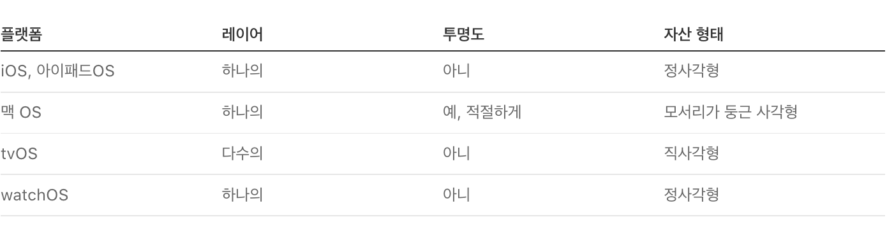

# App icons


본 문서는 Apple의 Human Interface Guideline(이하 HIG) 문서를 한글로 번역한 것입니다. iOS 생태계 내에서 HIG를 읽으시는 분들이 언어가 영어이다보니 많은 불편함을 겪는 것을 보게 되었고, 이에 한글로 번역을 하게 되었습니다. iOS 커뮤니티 Async Swift에서 자율적으로 모인 10명이 함께 번역했으며, 일체의 상업적인 목적을 띄지 않습니다. 이 문서를 학습에 적극적으로 이용해주시되, 상업적인 용도로 이용하시는 것은 지양해주시기 바랍니다. 감사합니다.


## Introduction

**독특하고 기억에 남는 아이콘은 App의 특성과 개성을 전달하고 사람들이 App Store나 기기에서 해당 앱이나 게임을 한 눈에 알아볼 수 있도록 도와줍니다.**

아름다운 앱 아이콘은 모든 Apple 플랫폼에서 사용자 경험에 있어서 중요하며 모든 앱과 게임에 하나씩만 존재합니다. 디자이너들은 항상 아름다우면서 전달하고자 하는 메세지를 잘 담고 있는 일관적인 앱 아이콘을 만들고 싶어합니다. 다음 두가지를 참고하시면 좋습니다. [Apple Design Resources](https://developer.apple.com/design/resources/)(아이콘 템플릿 다운로드), [Icons](https://developer.apple.com/design/human-interface-guidelines/foundations/icons/)(아이콘 생성에 대한 가이드라인)

***

## Best practices

**단순함을 수용합니다.** 단순한 아이콘은 사람들이 이해하고 인식하기 더 쉽습니다. 앱이나 게임의 컨셉에 맞는 아이콘만의 독특한 표현 방식을 만드세요. 너무 많은 세부 정보를 추가하면 식별하기 어려울 수 있고 특히 작은 크기에서 아이콘이 흐릿하게 보일 수 있으므로 피하십시오. 기본 이미지를 잘 보여줄 수있는 단순한 배경을 사용하는 것이 좋습니다. 전체 아이콘을 콘텐츠로 채울 필요가 없습니다.

**여러 플랫폼에서 잘 적용되는 디자인을 만들어 각 플랫폼에서 사람들이 편안함을 느낄 수있도록 해야합니다.** 앱이나 게임이 둘 이상의 플랫폼에서 실행되는 경우 모든 아이콘에 유사한 이미지와 색상 팔레트를 사용하세요. 예를 들어 iOS 및 watchOS에서 메일 앱 아이콘은 간소화된 그래픽 스타일을 사용하여 파란색 배경에 흰색 봉투를 나타냅니다. macOS는 비슷한 파란색 배경을 사용하여 봉투에 깊이와 디테일을 추가하여 사실적인 무게와 질감을 제공합니다.

**사용자의 경험 또는 브랜드를 위해 꼭 필요할때 텍스트를 포함하는 것이 좋습니다.** 아이콘의 텍스트는 종종 너무 작아서 쉽게 읽을 수 없고 아이콘이 복잡하게 보일 수 있으며 손쉬운 사용(accessibility) 또는 현지화(localization)를 지원하지 않습니다. 일부 상황에서는 앱 이름이 아이콘 근처에 표시되어 이름을 표시하는 것이 중복됩니다. 앱 이름의 첫 글자를 니모닉을 사용하면 사람들이 앱이나 게임을 인식하는 데 도움이 될 수 있지만 사람들에게 앱이나 게임을 어떻게 처리해야 하는지 알려주는 불필요한 단어(예: "시청" 또는 "재생") 또는 "(신규' 또는 'iOS용')사용을 지양합니다.

*   역자설명

    앱 아이콘에 브랜드 명이 들어가는 것은 피하는 것이 좋습니다. 하지만 밑에 배달의 민족의 로고와 같이 기업의 브랜드를 어필하는 배민이라는 키워드가 앱을 사용자들이 인지하는데 있어 중요한 부분을 차지한다면 사용하는 것이 좋습니다. 한마디로 요기오, 여기어때, 배민 등은 이 텍스트 자체가 하나의 로고가 된 것입니다.

    
*   역자설명

    Mnemonic : 니모닉, 외우기 어려운 정보를 연상되는 것에 연결해 외우기 쉽게 만드는 것.

**사진보다 그래픽 이미지를 사용하는 것이 좋습니다. 또한 아이콘에 UI 구성 요소를 사용하는 것을 지양합니다.** 사진은 작은 크기로 볼 때 제대로 표시가 되지 않습니다. 사진을 사용하는 대신 앱을 잘 설명하는 기능을 강조하는 콘텐츠의 그래픽 표현을 만듭니다. 그리고 표준 UI 구성 요소를 복제하거나 아이콘에 앱 스크린샷을 사용하지 마세요.

**필요한 경우 아이콘을 사람들이 볼 수 있는 모든 크기에서 보기 좋게 만드세요.** 예를 들어, App Store는 큰 사이즈의 아이콘을 표시하는 반면 시스템은 설정 및 알림과 같은 위치에 작은 사이즈의 아이콘을 표시합니다. iOS, iPadOS 및 watchOS에서 시스템은 1024×1024 픽셀 앱 아이콘을 사용하여 다른 모든 크기를 생성할 수 있습니다. macOS 및 tvOS에서는 모든 사이즈의 아이콘을 제공해야 합니다. 앱 아이콘의 시스템 생성 버전을 사용하지 않고 대신 직접 생성하려는 경우 아이콘 크기가 줄어들더라도 이미지가 선명한 상태를 유지해야 합니다. 예를 들어, 이미지를 단순화하고 주요 기능을 강조하여 불필요한 정보를 최소화 할 수 있습니다. 일반적으로 앱 아이콘이 모든 컨텍스트에서 시각적으로 일관되게 유지되도록 하는 것이 가장 좋습니다.

**아이콘을 정사각형 이미지로 디자인합니다.** 대부분의 플랫폼에서 시스템은 플랫폼의 미관에 맞게 아이콘 모서리가 자동으로 조절됩니다. 예를 들어 watchOS는 원형 마스크를 자동으로 적용합니다. (macOS는 예외) 시스템이 Mac Catalyst로 생성한 앱 아이콘에 둥근 직사각형 모양을 적용하더라도 macOS 앱 아이콘을 올바른 모양으로 제작해야합니다. 각 플랫폼에 대한 앱 아이콘을 만드는 데 도움이 되는 다운로드 가능한 제작 템플릿은 [Apple Design Resources](https://developer.apple.com/design/resources/)를 참고하세요.

*   역자설명

    Mac Catalyst : 아이패드 앱을 맥용으로 전환하는 툴

기본 **앱 아이콘을 대체할 수 있는 아이콘 제공을 고려하세요.** iOS, iPadOS 및 tvOS에서 사람들은 앱 또는 게임을 더욱 즐기기 위해 대체 아이콘을 선택할 수 있습니다. 예를 들어 스포츠 앱은 팀마다 다른 아이콘을 제공할 수 있습니다. 앱 설정을 통해 사람들은 자신이 원하는 앱 아이콘을 선택해 바꿀 수있습니다. 이때 사용되는 다양한 아이콘들은 다른 아이콘과 착각하지 않게 잘 디자인 되어야 합니다.

> 📑 **NOTE** 기본 앱 아이콘과 마찬가지로 대체할 수있는 앱 아이콘도 앱 검토의 대상이 되며 다음을 준수해야 합니다.
>
> [App Store Review Guidelines](https://developer.apple.com/app-store/review/guidelines/#design)

**Apple 하드웨어 제품의 복제품을 사용하지 마세요.** Apple 제품은 저작권이 있으며 앱 아이콘에서 복제할 수 없습니다.

***

## Platform considerations

#### iOS, iPadOS

**설정 아이콘에 오버레이나 테두리를 추가하지 마세요.** iOS는 설정의 흰색 배경에서 잘 보이도록 모든 아이콘에 자동으로 1픽셀 획을 추가합니다.

#### macOS

macOS에서 앱 아이콘은 둥근 직사각형 모양, 정면을 향한 원근감, 수평 위치 및 균일한 그림자를 포함하여 공통적인 시각적 속성을 공유합니다. macOS 디자인 언어에 뿌리를 둔 이러한 속성은 사람들이 macOS에서 기대하는 스타일을 보여주면서 조화로운 사용자 경험을 제공합니다.

**사용자들이 이 앱이 어떤 작업을 수행하는 앱인지 쉽게 알기위해 앱에 맞는 적절한 도구를 사용하세요.** 아이콘 배경을 사용하여 도구가 사용되는 환경을 묘사할 수있습니다. 예를 들어, TextEdit 아이콘은 실용적인 필기 경험을 사용자에게 제공하기 위해 샤프 펜슬과 줄이 그어진 종이 한 장을 아이콘으로 보여줍니다. 펜과같은 도구의 사실적인 이미지를 만든 후에는 배경 바로 위에 띄우고 아이콘 경계를 약간 지나 좀더 입체적으로 보이게 하는 것이 좋습니다.

**앱 아이콘에 실제 물체를 묘사하는 경우 실제 물질과 유사하게 묘사해 실제 질량이 있는 것처럼 보이게 하는 것이 좋습니다.** 물체의 무게를 전달하기 위해 천, 유리, 종이, 금속과 같은 물질의 특성을 함께 묘사하는 것이 좋습니다. 예를 들어, Xcode 앱 아이콘에는 강철이 잘 묘사된 망치가 있습니다.

**그림자 효과를 사용하세요.** 아이콘 디자인 [template](https://developer.apple.com/design/resources/#macos-apps) 에서 그림자를 사용하세요. 템플릿에는 시스템 정의된 그림자가 포함되어 있습니다. 앱 아이콘이 다른 macOS 아이콘과 조화되도록 도와줍니다.

**사실감을 더하기 위해 내부 그림자와 하이라이트를 사용해 보세요.** 예를 들어 메일 앱 아이콘은 그림자와 하이라이트를 모두 사용하여 봉투에 실체감을 부여하고 덮개가 약간 열려 있음을 나타냅니다. TextEdit 또는 Xcode와 같이 배경 위에 떠 있는 도구가 포함된 아이콘에서 내부 그림자는 사용자에게 도구를 실제처럼 보이게 할 수 있습니다. 그림자와 하이라이트는 아이콘을 향하고 중심 바로 위에 위치하며 약간 아래쪽으로 기울어진 광원을 적용하는 것이 좋습니다.

둥**근 직사각형 말고 다른 형태의 도형을 사용하지 마십시오.** 드문 경우지만 기본적인 앱 아이콘 모양을 약간만 변경하고 싶더라도 앱 아이콘처럼 보이지 않는 아이콘이 생성될 위험이 있습니다. 맥 OS. 모양을 변경해야 하는 경우 둥근 직사각형 모양에서 벗어나지 않게 약간의 수정만 하는 것이 좋습니다.

**icon grid bounding box 내에 주요 콘텐츠를 표현합니다.** 모든 콘텐츠를 outer bounding box 안에 유지합니다. 아이콘의 주요 콘텐츠가 icon grid bounding box를 넘어가면 제 위치에서 제대로 보이지 않을 수있습니다. 아이콘에 도구를 위에 올리게 되면하 아래와 같이 도구의 위쪽 가장자리를 outer bounding box에 맞추고 아래쪽 가장자리를 inner bounding box에 맞추는 것이 좋습니다. 그리드를 사용하여 다른 아이콘과 일관된 크기의 아이콘을 제작할 수있습니다.

#### tvOS

tvOS 앱 아이콘은 2\~5개의 레이어를 사용하여 사람들의 시선에 맞춰 깊이와 사용자에게 역동적인 느낌을 줍니다. [Layered images](https://developer.apple.com/design/human-interface-guidelines/foundations/images#layered-images)을 참조하세요.

**레이어 분리를 적절히 사용합니다.** 아이콘에 로고가 포함된 경우 로고를 배경에서 분리합니다. 아이콘에 텍스트가 포함된 경우 parallax effect(시차 효과)가 발생할 때 다른 레이어에 의해 숨겨지지 않도록 텍스트를 앞으로 가져옵니다.



*   역자설명

    parallax effect : 시차(Parallax)는 고정된 먼 배경이 존재하는 상황에서 한 물체를 서로 다른 위치에 있는 두 관측자가 관측했을 때 발생하는 겉보기 위치의 차이 또는 변위입니다.

**그라디언트와 그림자를 주의해서 사용하세요.** 배경 그라디언트와 비네트는 시차 효과(parallax effect)와 혼동될 수 있습니다. 그라디언트의 경우 위에서 아래로 밝고 어두운 스타일을 선호합니다. 그림자는 일반적으로 배경 레이어(background layer)에 표시되고 앱 아이콘이 고정되어 있을 때 보이지 않는 해가 위에서 비추는 형태의 그림자가 가장 잘 보입니다.

**다양한 수준의 투명도 를 활용하여 깊이감과 생동감을 높입니다.** 투명도를 창의적으로 사용하면 아이콘이 더욱 돋보일 수 있습니다. 예를 들어 사진 아이콘은 중앙 부분을 반투명 부분이 포함된 여러 레이어로 분리하여 디자인에 더 큰 생동감을 줍니다.

**홈 화면 아이콘이 안전 영의(safe-zone)의 준수사양을 지키는지 확인하세요.** 사용자의 초점의 이동 및 시차 효과(parallax effect)에 의해 아이콘의 크기 및 이동에 따라 시스템에서 앱 아이콘 가장자리 주변의 콘텐츠가 잘릴 수 있습니다. 아이콘의 콘텐츠가 잘리지 않도록 하려면 tvOS에서 설명한 것처럼 약간의 추가적인 공간을 확보하세요.

#### watchOS

watchOS 앱 아이콘은 원형의 단순한 아이콘이며 텍스트(Label)를 표시하지 않습니다.

**아이콘 배경에 검은색을 사용하지 마세요.** 검은색 배경을 밝게 하거나 테두리를 추가하여 아이콘이 디스플레이 배경과 섞이지 않도록 합니다.

***

## Specifications

#### App icon attributes

모든 플랫폼의 앱 아이콘은 PNG 형식을 사용하고 다음 색 공간(color spaces)를 지원합니다.

* 디스플레이 P3(광역 색상)
* sRGB(색상)
* 회색 감마 2.2(회색조)

앱 아이콘의 레이어, 투명도 및 모서리 둥근 정도는 플랫폼마다 다를 수 있습니다.

## App icon sizes

#### iOS, iPadOS app icon sizes

App Store에 올리기 위해 1024x1024픽셀 크기의 앱 아이콘을 제공해야 합니다. 시스템에서 앱 아이콘을 자동으로 축소하여 다른 모든 크기를 생성하도록 할 수 있습니다. 또는 특정 크기에서 아이콘 모양을 사용자 지정하려는 경우 여러 버전을 제공할 수 있습니다.

*   역자설명

    [App Icon Generator](https://appicon.co/) 에서 아이폰 앱 아이콘을 한번에 만들 수있습니다.

#### macOS app icon sizes

App Store의 경우 macOS 앱 아이콘의 1024x1024픽셀 버전을 만듭니다. 또한 다음 크기의 아이콘도 제공해야 합니다.

#### tvOS app icon sizes

App Store의 경우 1280x768픽셀 버전의 tvOS 앱 아이콘을 만듭니다. 또한 다음 크기의 아이콘도 제공해야 합니다.

**홈 화면 아이콘에 safe zone을 사용하는 것을 고려하세요.** 사용자의 시선 및 시차에 의해 아이콘 크기 및 이동에 따라 앱 아이콘 가장자리 주변의 콘텐츠가 잘릴 수 있습니다. 아이콘의 콘텐츠가 너무 촘촘하게 잘리지 않도록 하려면 추가로 숨을 쉴 수 있는 공간을 포함할 수 있습니다.

#### watchOS app icon sizes

App Store의 경우 watchOS 앱 아이콘의 1024x1024픽셀 버전을 만듭니다. 시스템이 이 버전을 다른 모든 크기로 자동으로 축소하도록 할 수 있습니다. 또는 특정 크기에서 앱 아이콘의 모양을 사용자 정의하려는 경우 다음과 같은 사이즈의 아이콘을 제공할 수 있습니다. 모든 크기 값은 @2x입니다.

함께 제공할 iPhone 앱이 있는 경우 다음 크기의 watchOS 앱 아이콘도 제공해야 합니다.

***

## Resources

#### **Related**

* [Apple Design Resources](https://developer.apple.com/design/resources/)

#### **Videos**

*   [App Icon Design WWDC 2017](https://developer.apple.com/videos/play/wwdc2017/822/)

    
