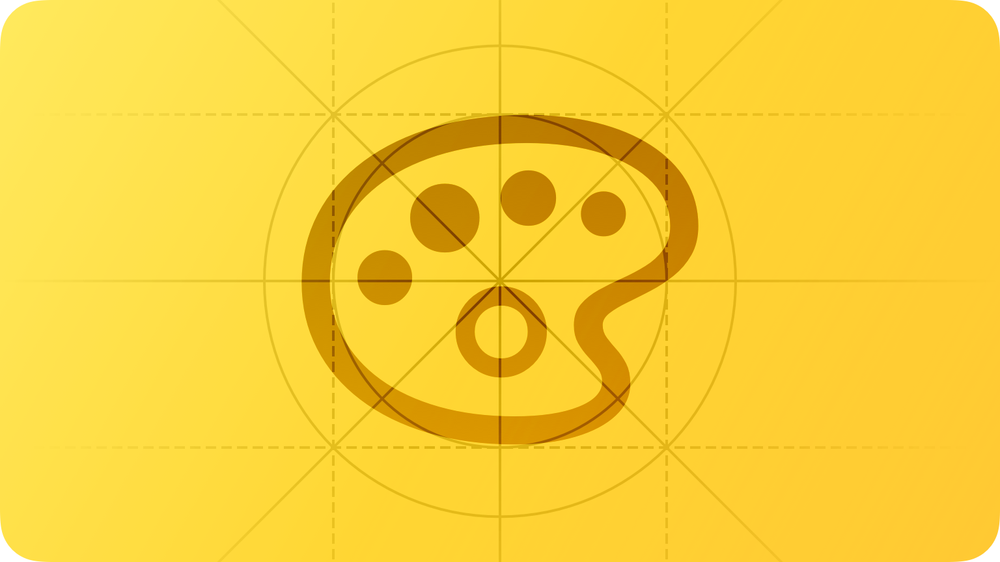
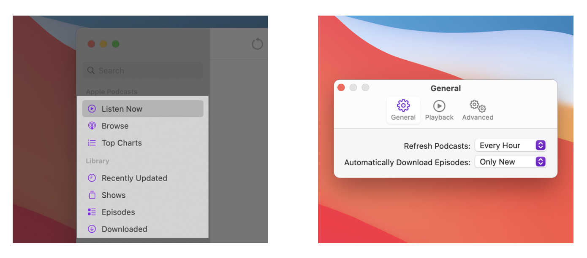

# Color


iOS 생태계 내에서 HIG를 읽으시는 분들이 언어가 영어이다보니 많은 불편함을 겪는 것을 보게 되었고, 이에 한글로 번역을 하게 되었습니다. iOS 커뮤니티 Async Swift에서 자율적으로 모인 10명이 함께 번역했으며, 일체의 상업적인 목적을 띄지 않습니다. 이 문서를 학습에 적극적으로 이용해주시되, 상업적인 용도로 이용하시는 것은 지양해주시기 바랍니다. 감사합니다.


<figure><figcaption></figcaption></figure>

## Introduction

**색상을 적절하게 사용하면 사용자와의 커뮤니케이션을 강화하고 브랜드를 부각시키며 시각적 연속성을 제공하고 상태 및 피드백을 전달하는 등 사용자들이 정보를 이해하는 데 도움이 됩니다.**

시스템은 다양한 환경에서 잘 보이는 색상을 보여주며, 자동으로 생동감과 사용자 접근성이 좋은 색상을 보여줍니다. 사람들은 시스템이 보여주는 색상에 익숙하기 때문에 시스템 색상을 사용하는 것이 좋습니다.

또한 사용자 지정 색상을 사용하여 앱 또는 게임의 시각적 경험을 향상하고 앱의 고유한 개성을 표현할 수도 있습니다. 이번 Color HIG를 통해 개발자, 디자이너들은 사람들에게 만족을 줄 수있는 색상을 선택하는데 도움을 줄 수 있습니다.

***

## Best practices

**게임이 아닌 앱에서는 색상을 보조로 사용하는 것이 좋습니다.** 게임이 아닌 다른 앱에서 색상을 과도하게 사용하면 의사소통이 명확하지 않고 주의가 산만해질 수 있습니다. 중요한 정보에 주의를 환기시키거나 인터페이스 간의 관계를 나타내기 위해 색상을 사용하는 것이 좋습니다.

**동일한 색상을 다른 의미로 사용하면 안됩니다.** 인터페이스 전체에서 일관되게 색상을 사용하세요. 특히 상태나 사용자가 기기를 사용할때 중요한 정보를 전달하는 데 색상을 일관되게 사용하는 것이좋습니다. 예를 들어 파란색 텍스트를 사람들에게 보여주면 이 텍스트를 탭하여 다른 View를 더 볼수 있다는 것을 알려줄 수 있습니다. 앱이 색상에 의존하지 않는 시각적 표시기(예: 갈매기 모양 또는 화살표 아이콘)를 사용하여 전달하는 경우에도 파란색 이외의 색상을 사용하게 되면 사람들이 혼란을 느낄 수있습니다.

**앱의 색상이 라이트 모드와 다크 모드에 둘다 잘 적용되는지 확인하세요.** 항상 검정색 배경을 사용하는 watchOS를 제외하고 플랫폼은 기본 모드 외에도 다크 모드를 제공합니다. 다크 모드는 모든 화면, 보기, 메뉴 및 컨트롤에 더 어두운 색상 팔레트를 사용하며 전경색과 배경색을 혼합해 생동감을 높여 전경 콘텐츠가 더 어두운 배경에 비해 눈에 띄게 만들 수 있습니다. 시스템 색상은 자동으로 두 가지 모드에서의 색을 모두 지원합니다. 사용자 정의 색상을 사용하는 경우 밝은 색상과 어두운 색상을 모두 제공해야 합니다. 가이드라인은 [Dark Mode](https://developer.apple.com/design/human-interface-guidelines/foundations/dark-mode)를 참고하세요

**다양한 조명 조건에서 앱의 색상을 테스트하세요.** 화창한 날 야외에서 또는 어두운 조명에서 앱을 실행하면 색상이 다르게 보일 수 있습니다.

**다양한 디스플레이가 있는 기기에서 앱을 테스트하세요.** 예를 들어, 특정 iPhone, iPad 및 Mac 모델에서 사용 가능한 True Tone 디스플레이는 주변광 센서를 사용하여 디스플레이의 화이트 포인트를 자동으로 조정하여 맞춥니다. 이렇듯 소설, 사진, 비디오 및 게임 등의 앱은 다양한 디스플레이 설정을 사용하여 tvOS 앱을 여러 브랜드의 HD 및 4K TV에서 테스트를 할 수있습니다. (개발자 가이드라인은 [UIWhitePointAdaptivityStyle](https://developer.apple.com/documentation/bundleresources/information\_property\_list/uiwhitepointadaptivitystyle)을 참고하세요)시스템 설정 > 디스플레이에서 프로필을 선택하여 Mac에서 P3 및 표준 RGB(sRGB)와 같은 다양한 색상 프로필을 사용하여 앱을 테스트할 수도 있습니다. [Color management](https://developer.apple.com/design/human-interface-guidelines/foundations/color#color-management) 을 참고하세요.

**삽화와 반투명도가 주변 색상에 어떤 영향을 미치는지 고려하세요.** 삽화의 변형으로 인해 주변 색상이 변경되는 경우가 있습니다. 사용자의 시각 연속성을 유지하고, 인터페이스의 요소가 너무 부각되지 않게 하는 것이 좋습니다. 예를 들어 지도는 지도 모드에서 밝은 색상을 표시하지만 위성 모드에서는 어두운 색상으로 전환합니다. 색상은 툴 바(toolbar)와 같은 반투명 요소 뒤에 배치되거나 적용될 때 다르게 나타날 수도 있습니다.

*   역자설명

    밑에 사진은 테마에 따른 지도의 변화를 보여줍니다. 투명도는 뒤에 배치되는 색에 따라 색상이 다르게 보여질 수있으니 꼭 체크해 봐야합니다.

    

**앱에서 사람들이 색상을 선택할 수 있다면 가능한 경우 시스템에서 제공하는 색상을 사용하는 것을 고려하세요.** 기본으로 제공하는 색상 피커(picker)를 사용하면 일관된 사용자 경험을 제공할 뿐만 아니라 사람들이 모든 앱에서 액세스할 수 있는 색상을 저장할 수 있습니다. 개발자 가이드라인은 [NSColorPanel](https://developer.apple.com/documentation/appkit/nscolorpanel) (macOS) 와 [UIColorWell](https://developer.apple.com/documentation/uikit/uicolorwell) 그리고 [UIColorPickerViewController](https://developer.apple.com/documentation/uikit/uicolorpickerviewcontroller) (iOS, iPadOS, and Mac Catalyst)를 참고하세요.

***

## Inclusive color

**물체를 구별하거나, 상호 작용을 나타내거나, 필수 정보를 전달하기 위해 색상에만 의존하지 마세요.** 정보를 전달하기 위해 색상을 사용할 때 색맹 또는 기타 시각 장애가 있는 사람들이 이해할 수 있도록 동일한 정보를 다른 방법으로 제공해야 합니다. 예를 들어 레이블이나 글리프(특수문자) 모양을 사용하여 개체나 상태를 식별할 수 있습니다.

**앱의 콘텐츠를 인식하기 어렵게 만드는 색상을 사용하지 마세요.** 예를 들어 대비가 충분하지 않으면 아이콘과 텍스트가 배경과 섞여 콘텐츠를 읽기 어렵게 만들 수 있으며 색맹인 사람은 인식하지 못할 수 있습니다. [Color and effects](https://developer.apple.com/design/human-interface-guidelines/foundations/accessibility/#color-and-effects)를 참고하세요.

**사용하는 색상이 다른 국가와 문화에서 어떻게 인식될 수 있는지 고려하세요.** 예를 들어 빨간색은 일부 문화권에서는 위험을 나타내지만 다른 문화권에서는 긍정적인 의미를 나타냅니다. 앱의 색상이 의도한 메시지를 전달하는지 확인하세요.

***

## System colors

**앱에서 시스템 색상 값을 하드 코딩하지 마세요.** 문서화된 색상 값은 앱 디자인 과정에서 참조용입니다. 실제 색상 값은 다양한 환경 변수에 따라 변동될 수 있습니다. [Color](https://developer.apple.com/documentation/swiftui/color)와 같은 API를 사용하여 시스템 색상을 적용합니다.

iOS 및 macOS는 라이트 모드와 다크 모드에 자동으로 적절한 색상 세트를 적용합니다. 예를 들어, 일부 색상은 다양한 계층에서 배경을 나타내고 다른 색상은 레이블, 링크 및 구분 기호와 같은 콘텐츠를 나타냅니다.

**다이나믹 시스템 컬러(dynamic system colors)를 대체하지 마세요.** 다이나믹 시스템 컬러(dynamic system colors)는 다양한 환경 변수에 따라 자동으로 적절히 변경됩니다.

*   역자설명

    밑에 사진이 애플이 제공하는 시스템 컬러입니다. 시스템 컬러를 사용하면 다양한 모드에서 자동으로 지정된 색을 바꿔줍니다.

    

**다이나믹 시스템 컬러(dynamic system colors)의 정의를 재정의하지 마세요.** 사람들에게 일관된 경험을 보장하고 의도한 인터페이스를 보여주기 위해 다이나믹 시스템 컬러(dynamic system colors)를 사용하세요.

***

## Color management

색상 공간은 RGB 또는 CMYK와 같은 색상 모델의 색상을 나타냅니다. 색역이라고도 하는 일반적인 색 공간은 sRGB와 Display P3입니다.

색상 프로파일은 색상을 숫자 표현에 매핑하는 데이터 테이블 또는 수학 공식을 사용하여 색상 공간의 색을 설명합니다. 이미지는 장치가 이미지의 색상을 올바르게 해석하고 디스플레이에서 재현할 수 있도록 색상 프로필을 포함합니다.

**이미지에 색상 프로필을 적용합니다.** 색상 프로필을 사용하면 앱의 색상이 다양한 디스플레이에서 의도한 대로 표시될 수 있습니다. sRGB 색상 공간은 대부분의 디스플레이에서 정확한 색상을 생성합니다.

**와이드 컬러를 사용하여 호환되는 디스플레이의 시각적 경험을 향상합니다.** 와이드 컬러 디스플레이는 sRGB보다 풍부하고 채도가 높은 색상을 생성할 수 있는 P3 색 공간을 지원합니다. 결과적으로 와이드 컬러를 사용하는 사진과 동영상은 보다 생동감 있고, 와이드 컬러를 사용하는 시각적 데이터와 상태 표시기는 사용자에게 더 의미가 있을 수 있습니다. 픽셀당 16비트(채널당)의 디스플레이 P3 색상 프로필을 사용하고 이미지를 PNG 형식으로 내보냅니다. 와이드 컬러 이미지를 디자인하고 P3 색상을 선택하려면 와이드 컬러 디스플레이를 사용해야 합니다.

*   역자설명

    Wide Color : 광역 RGB 색상 공간은 Adobe Systems에서 개발 한 RGB 색상 공간으로 순수한 스펙트럼 기본 색상을 사용하여 큰 색상 영역을 제공합니다. sRGB 또는 Adobe RGB 색상 공간보다 더 넓은 색상 값을 저장할 수 있습니다

**필요한 경우 공간별 이미지 및 색상 변형을 합니다.** 일반적으로 P3 색상 및 이미지는 sRGB 디스플레이에서 잘 나타납니다. 때때로 sRGB 디스플레이에서 볼 때 두 개의 매우 유사한 P3 색상을 구별하기 어려울 수 있습니다. P3 색상을 사용하는 그라디언트는 sRGB 디스플레이에서 잘려서 나타날 수도 있습니다. 이러한 문제를 방지하고 와이드 컬러 및 sRGB 디스플레이 보장하기 위해 Xcode 프로젝트의 asset catalog를 사용하여 각 색상 공간에 대해 서로 다른 버전의 이미지와 색상을 제공할 수 있습니다. [How to start designing assets in Display P3](https://developer.apple.com/news/?id=5cda5ipr)를 참고하세요

***

## Platform considerations

#### iOS, iPadOS

iOS는 시스템 및 그룹화된 두 가지 배경색들을 제공합니다. 각 배경색에는 정보 계층 구조를 전달하는 데 도움이 되는 1차, 2차 및 3차 변형이 포함되어 있습니다. 일반적으로 그룹화된 테이블 보기가 있는 경우 그룹화된 배경색([systemGroupedBackground](https://developer.apple.com/documentation/uikit/uicolor/3173145-systemgroupedbackground), [secondarySystemGroupedBackground](https://developer.apple.com/documentation/uikit/uicolor/3173138-secondarysystemgroupedbackground), 그리고 [tertiarySystemGroupedBackground](https://developer.apple.com/documentation/uikit/uicolor/3173155-tertiarysystemgroupedbackground))를 사용합니다. 그렇지 않으면 시스템 배경색 세트([systemBackground](https://developer.apple.com/documentation/uikit/uicolor/3173140-systembackground), [secondarySystemBackground](https://developer.apple.com/documentation/uikit/uicolor/3173137-secondarysystembackground), 그리고 [tertiarySystemBackground](https://developer.apple.com/documentation/uikit/uicolor/3173154-tertiarysystembackground))를 사용합니다.

두 가지 배경색 집합에서 다음과 같은 방식으로 계층 구조를 나타냅니다.

* 전체 View를 위한 기본
* 전체 View 내에서 콘텐츠 또는 요소를 그룹화하기 위한 보조
* 2차 요소 내에서 콘텐츠 또는 요소를 그룹화하기 위한 3차 요소

한눈에 보이는 콘텐츠의 경우 iOS는 다음과 같은 dynamic colors을 정의합니다.

*   역자설명

    자세한 설명은 [Platform considerations](https://developer.apple.com/design/human-interface-guidelines/foundations/color#platform-considerations)을 참고하세요.

#### macOS

macOS는 다음과 같은 dynamic system colors을 정의합니다(표준 색상 패널의 개발자 팔레트에서도 볼 수 있음).

#### App accent colors

macOS 11부터 accent color(악센트 색상)를 지정하여 앱 버튼, 강조 표시 및 사이드바 아이콘의 모양을 사용자가 원하는데로 지정할 수 있습니다. 시스템은 일반 > 강조 색상 설정의 현재 값이 다중 색상(multicolor)일 경우 경우 악센트 색상(accent color)를 적용합니다.

사람들이 악센트 색상(accent color) 설정을 하면 시스템은 사용자들이 선택한 색상을 지정해준 사이드바 아이콘을 제외하고 적절한 요소에 적용합니다. 왜냐하면 사이드바 아이콘은 사용자에게 색상을 통해 의미를 전달하기 때문입니다. 더 자세한 내용은 [Sidebars](https://developer.apple.com/design/human-interface-guidelines/components/navigation-and-search/sidebars)을 참고하세요.

#### tvOS

**앱 로고와 조화를 이루는 색상 팔레트를 선택하는 것을 고려하세요.** 색상의 세밀한 사용은 콘텐츠의 브랜드를 전달하는 데 도움이 됩니다.

**사람들의 집중을 유도하기 위해 색상만 사용하지 마세요.** 세밀한 크기 조정 및 반응형 애니메이션은 사용자가 각 요소에 집중하고 있을때 상호작용하는 주요 방법입니다.

#### watchOS

**앱의 배경색에 순수한 검정을 사용합니다.** 순수한 검정(즉, #000000 hex)은 Apple Watch 베젤과 매끄럽게 혼합되어 가장자리가 없는 화면을 만듭니다.

**사람들은 틴티드 모드를 사용하는 것보다 그래픽 컴플리케이션을 선호할 수 있습니다.** 시스템은 그래픽 컴플리케이션의 이미지, 게이지 및 텍스트에서 착용자가 선택한 색상을 기반으로 하는 단일 색상을 사용할 수 있습니다. [Complications](https://developer.apple.com/design/human-interface-guidelines/components/system-experiences/complications)을 참고하세요

***

## Specifications

#### iOS, iPadOS

*   역자설명

    자세한 내용은 [Specifications](https://developer.apple.com/design/human-interface-guidelines/foundations/color#specifications)을 참고하시는 것이 좋습니다.

***

## Resources

#### **Related**

* [Dark Mode](https://developer.apple.com/design/human-interface-guidelines/foundations/dark-mode)
* [Accessibility](https://developer.apple.com/design/human-interface-guidelines/foundations/accessibility)

#### **Developer documentation**

* [Color — SwiftUI](https://developer.apple.com/documentation/swiftui/color)
* [UI element colors — UIKit](https://developer.apple.com/documentation/uikit/uicolor/ui\_element\_colors)

#### **Videos**

*   ****[**What's New in iOS Design** WWDC 2019](https://developer.apple.com/videos/play/wwdc2019/808/)

    
*   ****[**Get Started with Display P3** WWDC 2017](https://developer.apple.com/videos/play/wwdc2017/821/)

    
