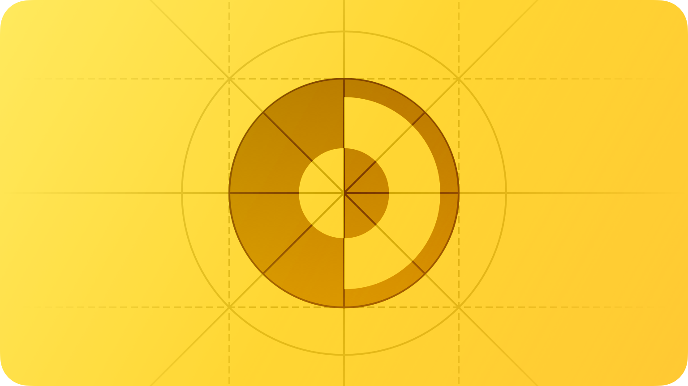

# Dark Mode


본 문서는 Apple의 Human Interface Guideline(이하 HIG) 문서를 한글로 번역한 것입니다. iOS 생태계 내에서 HIG를 읽으시는 분들이 번역본이 없어 불편함을 겪는 것을 알게 되었고, 이에 한글로 번역을 하게 되었습니다. iOS 커뮤니티 Async Swift에서 자율적으로 모인 9명이 함께 번역했으며, 일체의 상업적인 목적을 띄지 않습니다. 이 문서를 학습에 적극적으로 이용해 주시돼, 상업적인 용도로 이용하시는 것은 지양해 주시기 바랍니다. 감사합니다.


<figure><figcaption></figcaption></figure>

## Introduction

**다크 모드는 어두운 색상 팔레트를 사용하여 조명이 거의 없는 환경에 맞게 조정된 편안한 시청 경험을 제공하는 시스템 전체 모양 설정입니다.**

iOS, iPadOS, macOS 및 tvOS에서 사람들은 종종 기본 인터페이스 스타일로 다크 모드를 선택하고 일반적으로 모든 앱과 게임이 자신의 선호를 따르기를 기대합니다. 다크 모드에서 시스템은 모든 화면, 보기, 메뉴 및 컨트롤에 대해 어두운 색상 팔레트를 사용하고 대비를 통해 가장 앞면의 콘텐츠가 어두운 배경에 비해 눈에 띄게 만들 수도 있습니다.

***

## Best practice

**앱별 디스플레이(Appearance) 설정을 제공하지 않는 것이 좋습니다.** 앱별 디스플레이 모드 옵션을 사용하면 원하는 디스플레이를 나타내기 위해 다크모드를 포함해 둘 이상의 설정을 조정해야 하기 때문에 더 많은 작업을 수행해야 할 수 있습니다. 설상가상으로 앱이 시스템 전체의 디스플레이 선택에 응답하지 않기 때문에 앱이 고장났다고 생각할 수 있습니다.

**앱이 두 가지 모드 모두에서 잘 보이는지 확인하세요.** 기본 모드와 다크 모드를 사용하는 것 외에, 사람들이 자동 모양 설정을 추가할 때를 고려해야합니다. 자동 모양 설정은 앱이 실행되는 동안 조건이 변경됨에 따라 밝은 모양과 어두운 모양 사이를 전환합니다. 자동모양 설정이 있을 때는 더 유의하여 두가지 모드에서 테스트 하세요.

**콘텐츠를 테스트하여 두 가지 디스플레이(Appearance) 모드 모두에서 편안하게 읽을 수 있는지 확인하세요.** 예를 들어 대비 증가 및 투명도 감소가 켜진 다크 모드에서, 어두운 배경에 있을 때 어두운 텍스트가 가독성이 떨어지는 부분을 찾을 수 있습니다. 또한 다크 모드에서 대비 증가를 켜면 어두운 텍스트와 어두운 배경 사이의 시각적 대비가 감소할 수 있습니다. 좋은 시력을 가진 사람들은 낮은 대비 텍스트를 읽을 수 있지만 이런 텍스트는 많은 사람들이 읽을 수 없습니다. 가이드라인은 [Color and effect](https://developer.apple.com/design/human-interface-guidelines/foundations/accessibility/#color-and-effects) 를 참고하세요.

**드문 경우지만 인터페이스에서 다크 모드만 사용하는 것이 좋습니다.** 예를 들어 몰입형 미디어 시청을 가능하게 하는 앱이 UI를 뒤로하고 사람들이 미디어에 집중할 수 있도록 영구적으로 다크 모드를 사용하는 것이 합리적일 수 있습니다.

***

## Dark Mode colors

다크 모드의 색상 팔레트에는 더 어두운 배경색과 더 밝은 전경색이 포함됩니다. 그래서 다크모드에 포함된 색상이 반드시 어두운 색상만이 아니라는 점을 인식하는 것이 중요합니다. 많은 색상이 그렇지만 일부는 그렇지 않습니다. 자세한 내용은 [Color > Specificarions](https://developer.apple.com/design/human-interface-guidelines/foundations/color/#specifications) 을 참고하세요.

\*\*현재 디스플레이(Appearance)에 적응하는 색상을 수용합니다. ‘\*\*시멘틱 색상(Semantic colors)’(like [labelColor](https://developer.apple.com/documentation/appkit/nscolor/1534657-labelcolor) and [controlColor](https://developer.apple.com/documentation/appkit/nscolor/1524856-controlcolor) in macOS or [separator](https://developer.apple.com/documentation/uikit/uicolor/3173139-separator) in iOS and iPadOS)을 사용하면 어떤 모드에서든 자동으로 색상이 변경되고, 커스텀 색상이 필요한 경우에는 Xcode 의 Asset catalog에서 Color Set asset을 추가해서 사용해야 합니다.

*   역자설명

    ‘시멘틱 색상(Semantic colors)’ 이란, 반대 색상을 미리 지정해 놓는 시스템 색상이며, ‘시스템 정의 색상(System-defined colors)’ 이란, 시스템이 정의한 색상입니다.

**모든 모양에서 충분한 색상 대비를 목표로 합니다.** ‘시스템 정의 색상(System-defined colors)’을 사용하면 전경 콘텐츠와 배경 콘텐츠 간에 좋은 명암비를 얻을 수 있습니다. 최소한 색상 간의 명암비가 4.5:1 이상이어야 합니다. 사용자 정의 전경색 및 배경색의 경우 특히 작은 텍스트에서 7:1의 명암비를 위해 노력하십시오. 이 비율은 전경 콘텐츠가 배경에서 눈에 띄도록 하고 콘텐츠가 접근성 지침을 충족하는 데 도움이 됩니다.

**흰색 배경의 색상을 부드럽게 합니다.** 흰색 배경이 포함된 콘텐츠 이미지를 표시하는 경우, 이미지를 약간 어둡게 하여 주변 다크 모드에서 배경이 빛나는 것을 방지합니다.

***

## Icons and images

시스템은 다크 모드에 자동으로 적응하는 [SF Symbol](https://developer.apple.com/design/human-interface-guidelines/foundations/sf-symbols) 및 밝고 어두운 모습 모두에 최적화된 풀 컬러 이미지를 사용합니다.

**가능하면 SF 기호를 사용하세요.** 기호는 동적 색상을 사용하여 색조를 지정하거나 생동감을 더할 때 두 가지 모양 모드에서 모두 잘 작동합니다. 가이드라인은 [Color](https://developer.apple.com/design/human-interface-guidelines/foundations/color) 을 참고하세요.

**필요한 경우 밝고 어두운 모양에 대해 별도의 인터페이스 아이콘을 디자인합니다.** 예를 들어, 보름달을 묘사하는 아이콘은 밝은 배경과 잘 대조되기 위해 미묘하고 어두운 윤곽이 필요할 수 있지만 어두운 배경에 표시될 때는 윤곽이 필요하지 않습니다. 마찬가지로 기름 한 방울을 나타내는 아이콘은 가장자리가 어두운 배경에서 보이도록 약간의 테두리가 필요할 수 있습니다.

**풀 컬러 이미지와 아이콘이 두 모양 모두에서 잘 보이는지 확인하세요.** 밝은 부분과 어두운 부분 모두에서 잘 보이면 동일한 에셋(Asset)을 사용하세요. 에셋(Asset)이 한 모드에서만 좋아 보이면, 에셋(Asset)을 수정하거나 별도의 밝은 자산과 어두운 자산을 만듭니다. 에셋 카탈로그(Asset catalog)를 사용하여 단일 이미지로 결합합니다.

***

## Text

시스템은 더 어두운 배경에서 텍스트의 가독성을 유지하기 위해 생동감과 증가된 대비를 사용합니다.

**시스템에서 제공하는 레이블 색상을 사용하십시오.** 1차, 2차, 3차 및 4차 레이블 색상은 밝고 어두운 모양에 자동으로 적용됩니다.

‘**시스템 뷰(System View)’를 사용하여 텍스트 필드와 텍스트 보기를 만드세요.** 시스템 보기 및 컨트롤을 사용하면 앱의 텍스트가 모든 배경에서 보기 좋게 나타나며 생기가 있는지 여부에 따라 자동으로 조정됩니다. 가능하면 텍스트를 직접 그리는 대신 시스템 제공 보기를 사용하여 텍스트를 표시하세요.

***

## Platform considerations

_No additional considerations for tvOS, or watchOS._

#### **iOS, iPadOS**

다크 모드에서 시스템은 하나의 다크 인터페이스가 다른 인터페이스 위에 레이어드될 때 깊이에 대한 인식을 향상시키기 위해 ‘기본(base)’와 ‘높은(elevated)’이라는 두 가지 배경 색상을 사용합니다. ‘기본(base)’는 더 어두워서 배경 인터페이스가 뒤로 물러나는 것처럼 보이고, ‘높은(elevated)’은 더 밝아져 전경 인터페이스가 전진하는 것처럼 보입니다.

**시스템 배경색을 선호합니다.** 다크 모드는 동적입니다. 즉, 팝오버 또는 모달 시트와 같이 인터페이스가 전경에 있을 때 배경색이 기본에서 높은 것(base to elevated)으로 자동 변경됩니다. 시스템은 또한 높은 배경색을 사용하여 멀티태스킹 환경의 앱과 다중 창 컨텍스트의 창 사이를 시각적으로 구분합니다. 사용자 정의 배경색을 사용하면 사람들이 이러한 시스템 제공 시각적 구분을 인식하기가 더 어려워질 수 있습니다.

### macOS

사람들이 일반 설정에서 ‘흑연 강조 색상(Graphite accent color)’을 선택하면, macOS는 윈도우가 현재 데스크탑 사진에서 색상을 선택하도록 합니다. 이를통해 주변 콘텐츠와 더 조화롭고 미묘한 ‘데스크탑 틴팅(_desktop tinting)’_ 효과를 띄웁니다.

**필요에 따라 커스텀 컴포넌트 배경에 투명도를 추가합니다.** 투명도는 바탕 화면 색조가 활성화되어 있을 때, 구성 요소가 윈도우 배경에서 색상을 선택하도록 하여 바탕 화면그림이 변경되는 경우에도 지속될 수 있는 시각적 조화를 만듭니다. 이러한 조화를 이루려면 배경이나 베젤(Bezel)이 보이는 사용자 지정 구성 요소에만 투명도를 추가하고 구성 요소가 색상을 사용하지 않는 상태와 같은 중립 상태일 때만 투명도를 추가합니다. 구성 요소가 색상을 사용하는 상태에 있을 때는 투명도를 추가하고 싶지 않습니다. 이렇게 하면 윈도우 배경이 바탕 화면의 다른 위치로 조정되거나 바탕 화면 그림이 변경될 때 구성 요소의 색상이 변동할 수 있기 때문입니다.

*   역자설명

    **'베젤(Bezel)'**이란, 스마트폰이나 TV 등의 디스플레이에서 화면이 나오는 부분을 제외한 테두리 를 일컫는 말입니다.

***

## Resources

#### **Related**

* [Color](https://developer.apple.com/design/human-interface-guidelines/foundations/color)
* [Materials](https://developer.apple.com/design/human-interface-guidelines/foundations/materials)
* [Typography](https://developer.apple.com/design/human-interface-guidelines/foundations/typography)

#### **Videos**

*   ****[**What's New in iOS Design** WWDC 2019](https://developer.apple.com/videos/play/wwdc2019/808/)

    
*   [**Implementing Dark Mode on iOS WWDC 2019**](https://developer.apple.com/videos/play/wwdc2019/214/)

    
