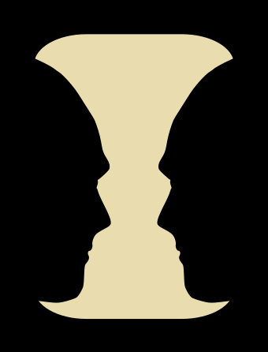
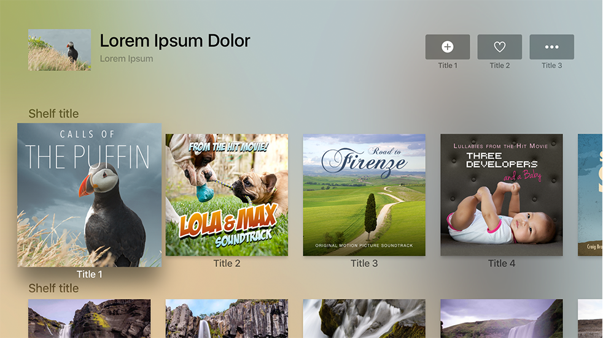

# Layout


본 문서는 Apple의 Human Interface Guideline(이하 HIG) 문서를 한글로 번역한 것입니다. iOS 생태계 내에서 HIG를 읽으시는 분들이 번역본이 없어 불편함을 겪는 것을 알게 되었고, 이에 한글로 번역을 하게 되었습니다. iOS 커뮤니티 Async Swift에서 자율적으로 모인 9명이 함께 번역했으며, 일체의 상업적인 목적을 띄지 않습니다. 이 문서를 학습에 적극적으로 이용해 주시돼, 상업적인 용도로 이용하시는 것은 지양해 주시기 바랍니다. 감사합니다.


<figure><figcaption></figcaption></figure>

## Introduction

**다양한 맥락에 맞는 일관된 레이아웃을 사용하는 것은 이해하기 쉬운 사용자 경험을 만들고, 모든 기기에서 사용자들이 좋아하는 앱과 게임을 즐길 수 있게 해줍니다.**

***

## **Guides and safe areas**

레이아웃 가이드(layout guide)는 화면에 콘텐츠를 위치, 정렬시키고 간격을 주는 것을 도와주는 직사각형 영역입니다. 이 시스템은 콘텐츠 주위에 표준 여백을 쉽게 적용하고 뛰어난 가독성을 위해 텍스트 너비를 제한할 수 있는 사전 정의된 레이아웃 가이드를 포함합니다. 또한 커스텀 레이아웃 가이드를 정의할 수도 있습니다.

안전 영역은 네비게이션 바, 탭 바, 툴 바, 또는 화면에 나타나는 다른 뷰에 덮여있지 않는 뷰 안의 영역입니다. iPhone의 다이나믹 아일랜드 또는 몇몇 Mac 모델의 카메라 하우징과 같은 디바이스의 디스플레이나 인터렉티브 기능을 피하기 위해서는 안전 영역이 필수적입니다.

iOS, iPadOS 및 tvOS에서 시스템은 앱이 화면에 표시되는 방식에 영향을 줄 수 있는 디바이스 환경의 변화를 특징짓는 특성의 모음을 정의합니다. SwiftUI 혹은 Auto Layout을 사용하면 다음과 같은 다양한 특성에 인터페이스가 동적으로 적응할 수 있습니다.

* 다양한 디바이스 화면 크기, 해상도 및 색 영역
* 다양한 디바이스 방향 (가로/세로)
* 스플릿 뷰
* iPad의 외장 디스플레이 지원, 디스플레이 확대, 그리고 멀티태스킹 모드
* 동적 텍스트 크기 변화
* 시스템이 지역에 따라 활성화할 수 있는 국제화 기능 (왼쪽→오른쪽/오른쪽→왼쪽 레이아웃 방향, 날짜/시간/숫자 포맷, 서체 변형, 텍스트 길이)
* 시스템 기능 가용성

***

## Best Practices

**가능한 한 같은** 콘텐츠**를 표시하면서도, 맥락의 변화에 적절히 맞춰지는 일관된 레이아웃을 설계하세요.** 사람들은 기기를 회전시키거나, 창의 크기를 조절하거나, 다른 기기로 전환했을 때 사용자 경험이 매끄럽게 작동하고 익숙하게 유지되기를 기대합니다. 시스템 정의 안전 영역, 여백 및 가이드를 준수하고 계층 내 뷰들의 배치를 미세 조정할 수 있는 레이아웃 조정자(layout modifier)를 지정해 적응형 인터페이스를 보장합니다.

**각 플랫폼의 주요 디스플레이 및 시스템 기능들을 존중하세요.** 안전 영역은 다양한 기기의 모서리 곡률 및 센서 하우징과 같은 요소들과 iPhone의 다이나믹 아일랜드, iPhone 및 iPad의 홈 인디케이터와 앱 전환기(App Switcher)와 같은 인터랙티브한 시스템 요소에 간섭하지 않도록 최적화합니다. 안전 영역은 또한 바(bars)와 같은 인터랙티브 구성 요소를 고려하는 데 도움이 되며 크기가 변경되면 콘텐츠를 동적으로 재배치합니다.

**배치를 활용해 상대적인 중요도를 보여주세요.** 일반적으로 주요 아이템은 화면, 창의 위쪽 절반, 앞쪽(leading)에 가까운 위치에 배치합니다. 화면을 보거나, VoiceOver와 같은 스크린 리더를 사용하는 경우 일반적으로 이 방향에서 시작합니다.

**충분한 공간을 주어서 중요 정보를 강조하세요.** 사람들은 가장 중요한 정보를 바로 보기 원하기 때문에, 중요하지 않은 세부 정보들로 화면을 어지럽히는 것을 원하지 않습니다. 사람들은 스크롤을 통해 2차 정보에 쉽게 접근할 수 있습니다.

**사람들이 원하는 정보를 찾을 수 있도록 시각적 그룹을 생성하세요.** 예를 들어 네거티브 스페이스(Negative Space), 배경의 형태, 색상 및 재질, 또는 구분선을 사용해 별개의 영역들에 관련된 요소 및 정보를 표시할 수 있습니다.

*   역자 설명

    네거티브 스페이스(Negative Space) 란 이미지에서 대상과 대상 사이의 빈 공간입니다. 네거티브 스페이스는 피사체 자체가 아닌 피사체 주변의 공간이 특정한 모양을 형성할 때 가장 뚜렷해지고, 그 공간은 때때로 예술적 효과를 위해 사용됩니다.

    아래는 네거티브 스페이스의 대표적인 예시인 루빈의 꽃병입니다. 꽃병 양 옆으로 사람의 옆얼굴로 보이는 형태가 있습니다.

<figure><figcaption></figcaption></figure>

**정렬을 사용해 시각적 스캔을 용이하게 하고 조직 및 계층 구조를 전달하세요.** 정렬은 앱이 깔끔하고 정돈되어 보이고 스크롤 할 때 집중할 수 있도록 하며 정보를 쉽게 찾을 수 있게 도와줍니다. 또한 들여쓰기와 정렬은 사람들이 정보 계층을 시각화하는 데 도움이 됩니다.

**종횡비에 주의하세요.** 화면 크기에 따라 종횡비가 다를 수 있으며, 이로 인해 아트워크가 잘리거나 레터박스 혹은 필러박스가 표시될 수 있습니다. 이 경우에는 아트워크의 종횡비를 변경하지 말고 중요한 시각 콘텐츠가 모든 화면 사이즈에서 표시되도록 화면을 채울 수 있게 크기를 조정하십시오.

**텍스트 크기 변경에 대비하세요.** 사람들은 다른 텍스트 크기를 선택할 때 대부분의 앱이 이에 반응하기를 기대합니다. 텍스트 크기 변경에 대응하기 위해서 레이아웃을 조정해야 할 수도 있습니다. 앱에 텍스트를 표시하는 것에 대한 가이드라인은 [Typography](https://developer.apple.com/design/human-interface-guidelines/foundations/typography)를 참고하세요.

**가능하다면 화면 밖 요소(offscreen elements)를 일부분 표시하여 숨겨진** 콘텐츠**를 암시하는 것을 고려하세요.** 콘텐츠가 한 화면에 들어오지 않는 큰 항목들에서는 화면 밖에 있는 항목의 일부를 표시해 추가 콘텐츠를 암시할 수 있습니다.

**터치스크린에서는 인터렉티브한 요소에 충분한 터치 영역을 제공하세요.** 모든 컨트롤에 대해 최소 44x44포인트의 터치 가능 영역을 유지합니다.

**다양한 화면 방향, 현지화 및 텍스트 크기를 적용해 여러 기기에서 앱을 미리보기 하세요.** 일반적으로 와이드컬러와 같은 기능은 실제 기기에서 미리보는 것이 최선이지만, Xcode Simulator를 사용하여 클리핑 및 기타 레이아웃 문제를 확인할 수 있습니다. 예를 들어 iOS앱이 가로 모드를 지원하는 경우 시뮬레이터를 사용해 기기가 왼쪽 혹은 오른쪽으로 회전하든 상관 없이 적절한 레이아웃으로 보이게 할 수 있습니다.

***

## **Platform considerations**

#### iOS, iPadOS

**가로와 세로 방향 모두 지원하는 것을 목표로 하세요.** 사람들은 다양한 이유로 다른 방향을 선택하고 일반적으로 모든 상황에서 앱이 잘 작동하기를 기대합니다. 앱이 한 방향으로 실행되는 것이 중요한 경우, 사람들에게 기기를 회전하라고 말하지 않는 것이 좋습니다. 사용자가 지원되지 않는 방향으로 기기를 잡았을 때 앱이 자동으로 회전하지 않는다면 본능적으로 기기를 돌려야 한다는 것을 알게 됩니다. 가로로만 사용하는 앱이라면 기기를 왼쪽 혹은 오른쪽 어느 방향으로 돌려도 잘 작동해야 합니다.

**앱이 특정 기기에서 실행되는 경우, 해당 기기의 모든 디스플레이 크기로 실행되는지 확인하세요.** 즉, iPhone 전용 앱은 모든 iPhone 화면 크기에서 실행되어야 하며 iPad 전용 앱은 모든 iPad 화면 크기에서 실행되어야 합니다. 가이드라인은 [Device screen sizes and orientations](https://developer.apple.com/design/human-interface-guidelines/foundations/layout#device-screen-sizes-and-orientations) 을 참고하세요.

**전체 폭 버튼을 삽입하세요.** 전체 폭 버튼 측면에는 시스템 정의 표준 여백을 준수하는 것이 좋습니다. 화면 하단의 전체 폭 버튼은 일반적으로 모서리가 둥글도 안전 영역의 하단에 정렬되었을 때 가장 보기 좋습니다. 또한 홈 인디케이터와 겹쳐지지 않는 것을 보장하세요.

**화면을 채우도록 시각** 콘텐츠**를 확장하세요.** 배경이 디스플레이 가장자리까지 확장되고 표나 컬렉션과 같이 수직으로 스크롤할 수 있는 레이아웃이 가장 아래쪽까지 이어지는지 확인하는 것이 좋습니다.

**iPad에서는 화면 측면에 가로 방향으로 컨트롤을 배치하는 것을 고려해 보세요.** 화면 좌우에 컨트롤이 있으면, 기기를 들고 있는 동안 양손으로 쉽게 컨트롤에 닿을 수 있습니다.

**가능한 인터렉티브 컨트롤을 화면 하단에 배치하지 마세요.** 사용자들은 \*\*\*\*방향과 관계없이 디스플레이 하단에 있는 시스템 제스처를 사용해 홈 스크린이나 앱 전환기 등의 기능을 사용합니다. 이 제스처는 이 영역에 구현된 커스텀 제스처를 취소시킬 수 있습니다. 또, 화면의 먼 구석에 컨트롤을 두지 않는 것이 좋습니다. 사람의 손이 편안하게 닿기 어려울 수 있기 때문입니다. 게임에서 화면 하단(안전 영역 아래)에 컨트롤을 배치해야 할 경우 화면 상단과 하단에 배치할 때 일치하는 삽입물을 사용하고, 사람들이 컨트롤과 상호작용을 하려고 할 때 실수로 조작하지 않도록 홈 인디케이터 주위에 충분한 공간을 두세요.

**다양한 상태 표시줄(status bar) 높이에 대비하세요.** 상태 표시줄 아래에 콘텐츠를 표시하는 경우, 안전 영역을 사용해 필요에 따라 동적으로 콘텐츠의 위치를 변경할 수 있습니다.

**상태 표시줄이 없는 것이 가치 있거나 사용자 경험을 향상시킬 때만 상태 표시줄을 숨기세요.** 상태 표시줄은 사람들이 유용하다고 생각하는 정보를 표시하며 대부분의 앱이 사용하지 않는 화면 영역을 차지하므로 일반적으로 이를 계속 표시하는 것이 좋습니다.

**iOS, iPadOS safe areas**

안전 영역은 뷰 컨트롤러(view controller)가 제공할 수 있는 네비게이션 바, 탭 바, 툴바 혹은 다른 기타 뷰에 포함되지 않는 뷰 안의 영역을 말합니다.

iPhone

iPad

**iOS keyboard layout guide**

iOS 15와 그 이후 버전은 키보드가 현재 차지하는 공간과 안전한 영역 삽입을 설명하는 키보드 레이아웃 가이드를 정의합니다. 이 가이드를 사용하면 사람들이 사용하는 키보드 유형이나 위치에 관계없이 키보드가 앱의 필수적인 부분처럼 느껴지도록 할 수 있습니다. 개발자 가이드라인은 [UIKeyboardLayoutGuide](https://developer.apple.com/documentation/uikit/uikeyboardlayoutguide/)를 참고하세요.

키보드가 나타나면 레이아웃 가이드가 해당 영역과 위치를 나타냅니다.

키보드가 사라지면 레이아웃 가이드의 상단이 안전 영역 레이아웃 가이드의 하단과 일치합니다.

#### macOS

**창 하단에 컨트롤이나 중요한 정보를 배치하지 마세요.** 사람들은 종종 창의 하단 모서리를 화면의 아래쪽으로 움직입니다.

#### tvOS

TV는 크기가 매우 다양합니다. Apple TV에서 앱 레이아웃은 iPhone이나 iPad처럼 화면 크기에 자동으로 적응하지 않습니다. 대신 앱은 모든 디스플레이에 동일한 인터페이스를 보여줍니다. 다양한 화면 크이게 적합할 수 있도록, 레이아웃을 설계할 때 각별한 주의를 기울이세요.

**화면의 안전 영역을 준수하세요.** 화면 상단과 하단에서는 60픽셀, 측면에서는 80픽셀의 여백을 삽입합니다. 사람들이 가장자리 가까이 있는 콘텐츠를 보기 어려울 수도 있으며 구형 TV의 오버스캔으로 인해 의도치 않은 화면 잘림이 발생할 수 있습니다. 의도적으로 화면 바깥으로 나가는 일부 화면 밖 콘텐츠와 요소(offscreen content and elements) 만 이 영역 밖에 나타나도록 하세요.

**포커스 가능한 요소 사이에 적절한 여백을 포함하세요.** UIKit과 focus API를 사용한 경우 포커스가 맞춰지면 요소가 커집니다. 포커스가 맞추어져 있을 때 요소가 어떻게 보이는지를 고려하고, 중요한 정보와 의도치 않은 겹침이 발생하지 않도록 하세요.

레이아웃 템플릿을 사용해 미디어 위주 앱을 제작하고 그리드를 사용해 콘텐츠 모음을 제공하세요. 미디어 앱의 레이아웃이 최소한의 레이아웃 커스텀으로 콘텐츠를 아름답게 표시하기만 하면 되는 경우 미리 설계된 레이아웃 템플릿을 사용하는 것이 좋습니다. 앱에서 콘텐츠 모음을 보여줘야 하는 경우 그리드를 사용하면 먼 곳에서 콘텐츠를 쉽게 탐색할 수 있게 하고, 리모컨으로 빠르게 탐색할 수 있습니다.

**Layout templates**

Apple TV 템플릿은 콘텐츠를 주목하도록 만드는 깔끔하고 일관된 레이아웃을 제공합니다. 이러한 템플릿은 JavaScript 및 Apple TV markup language(TVML)에 기반해 사람들이 앱을 열 때 동적으로콘텐츠를 로드하고 채웁니다. 템플릿을 사용하면 TV화면에서 보기 좋고 스트리밍 미디어에 이상적인 레이아웃으로 콘텐츠가 풍부한 앱을 유연하게 만들 수 있습니다.

용도에 따라 템플릿을 선택하세요. 템플릿의 배경, 색상, 크기, 레이아웃 등을 커스텀 할 수 있지만 커스텀으로 인해 템플릿이 훼손되거나 인식되지 않는 경우 다른 템플릿을 사용하거나 사용자 지정 인터페이스를 설계하는 것을 고려해 보는 것이 좋습니다.

* Alert template
  *

      <figure><figcaption></figcaption></figure>
  * Alert 템플릿에는 구매 확인 작업 또는 삭제와 같은 파괴적인 작업과 같은 행동을 수행할 수 있는 권한을 요청하는 메시지가 표시됩니다.

[Alerts](https://developer.apple.com/design/human-interface-guidelines/tvos/interface-elements/alerts/)을 참고하세요.

* Catalog template
  *

      <figure><figcaption></figcaption></figure>
  * Catalog 템플릿을 사용하여 영화 또는 TV 프로그램 장르와 같은 관련 항목들의 그룹을 표시할 수 있습니다. 사람들은 왼쪽에 있는 그룹 목록을 확인하고 오른쪽의 항목들에 집중합니다.
* Compilation template
  *

      <figure><figcaption></figcaption></figure>
  * Compilation 템플릿은 노래 또는 재생 목록의 트랙과 같은 항목에 포함된 요소를 표시합니다. 이 템플릿은 특히 오디오 관련 컨텐츠를 표시할 때 유용합니다.
* Descriptive Alert template
  *

      <figure><figcaption></figcaption></figure>
  *   Descriptive Alert 템플릿은 사용자에게 약관에 동의하거나 라이센스 동의서를 읽는 것과 같은 작업을 수행하도록 요청할 수 있는 긴 메시지를 표시할 수 있습니다.

      **보여주고, 말하지 마세요.** 가능한 한 경고 텍스트를 사용하지 않습니다. 이미지와 같이 더 직관적인 방식으로 동일한 정보를 표시하는 것을 목표로 하세요.

      **알림을 짧게 유지하고 사용자가 스크롤하지 않도록 하는 것이 좋습니다.** 거리가 떨어져 있는 화면에 있는 많은 텍스트를 읽는 것은 눈을 긴장시키고 재미있는 활동이 아닙니다. 앱에 표시되는 텍스트의 양을 최소화하세요.

      **메시지를 스크롤할 수 있는 경우 버튼을 나란히 배치하세요.** 이 레이아웃에서 상하로 스크롤하면 텍스트가 스크롤되고 좌우로 스크롤하면 버튼 간 선택이 전환됩니다.

      가이드라인은 [Alerts](https://developer.apple.com/design/human-interface-guidelines/tvos/interface-elements/alerts/)을 참고하세요.
* Form template
  *

      <figure><figcaption></figcaption></figure>
  *   Form 템플릿은 키보드와 이름 또는 이메일 주소와 같은 정보를 입력할 수 있는 하나 이상의 텍스프 필드를 표시합니다.

      가이드라인은 [Text and Search](https://developer.apple.com/design/human-interface-guidelines/tvos/interface-elements/text-and-search/)를 참고하세요.
* List template
  *

      <figure><figcaption></figcaption></figure>
  * List 템플릿은 오른쪽에 영화나 TV 프로그램 같은 항목의 목록을 표시합니다. 사람들은 왼쪽에 있는 아트워크 또는 설명과 같은 관련 내용을 보기 위해 집중합니다.
* Loading template
  *

      <figure><figcaption></figcaption></figure>
  *   Loading 템플릿은 서버가 내용을 검색하는 동안 일시적으로 진행률 표시기와 일부 설명을 표시합니다. 그것은 사용자들에게 무슨 일이 일어나고 있나는 것을 알려주기 때문에 앱이 멈춘 것처럼 보이지 않습니다.

      짧고 유용한 텍스트를 계속 로드하게요. 로딩이 빠르면 사람들은 긴 텍스트를 읽을 시간이 없을 수 있고, 무언가를 놓친 것처럼 느끼게 할 수 있습니다.

      가이드라인은 [Progress Indicators](https://developer.apple.com/design/human-interface-guidelines/tvos/interface-elements/progress-indicators/)를 참고하세요.
* Menu template
  *

      <figure><figcaption></figcaption></figure>
  *   Menu 템플릿은 컨텐츠에 대한 최초 페이지와 같은 최상위 탐색을 위해 설계되었습니다. 이 템플릿은 상단을 지나는 메뉴 아이템을 포함합니다. 사람들은 메뉴 아래의 관련 내용을 보기 위해 이 아이템에 집중합니다.

      **메뉴바를 깔끔하게 유지하세요.** 더 추가되는 각각의 아이템은 앱의 복잡성을 증가시킵니다.

      **메뉴 아이템을 화면에 유지하세요.** 메뉴 표시줄이 선택되었을 때 모든 항목이 표시되는지 확인하세요. 일반적으로 내용이 많거나 항목이 화면 밖으로 스크롤되지 않도록 글이 짧은 항목을 7개 이하로 포함합니다.

      가이드라인은 [Tab Bars](https://developer.apple.com/design/human-interface-guidelines/tvos/interface-elements/tab-bars/)를 참고하세요.
* Parade template
  *

      <figure><figcaption></figcaption></figure>
  * Parade 템플릿은 특정 장르의 영화 또는 앨범과 같은 컨텐츠의 그룹에 대해 반복되는 미리보기를 보여줍니다. 그룹의 목록이 오른쪽에 표시됩니다. 사람들은 왼쪽의 비 인터렉티브한 미리보기를 보기 위해 각각의 요소를 선택합니다.
* Product template
  *

      <figure><figcaption></figcaption></figure>
  *   Product 템플릿은 영화, TV 프로그램 또는 기타 제품을 홍보합니다. 여기에는 일반적으로 제품 이미지, 배경 및 설명 정보가 포함됩니다. 내용 아래의 선반에는 관련 제품이 표시되며, 사람들은 아래로 스크롤하여 출연자 및 제작진 목록, 등급 및 리뷰와 같은 더 많은 정보를 가져올 수 있습니다.

      배경을 커스텀할 경우 다른 컨텐츠와 충돌하지 않는 것을 확인하세요. 배경을 커스텀하기 전에 이미지 및 텍스트 색상을 신중하게 고려하는 것이 좋습니다. 기본적으로 배경에는 흐림 처리된 제품 이미지가 표시되므로 시각적인 효과를 보충합니다.
* Product bundle template
  *

      <figure><figcaption></figcaption></figure>
  * Product Bundle 템플릿은 시리즈 TV 프로그램, 영화 및 기타 제품들을 홍보합니다. 여기에는 일반적으로 이미지, 배경 및 설명이 포함됩니다. 내용 아래의 선반에는 TV 시즌 에피소드와 같이 번들에 포함된 제품이 표시됩니다. 사람들은 아래로 스크롤하여 출연진과 제작진 목록, 등급, 리뷰와 같은 더 많은 정보를 불러올 수 있습니다.
* Rating template
  *

      <figure><figcaption></figcaption></figure>
  * Rating 템플릿을 사용하여 영화나 노래와 같은 특정 항목의 점수를 매길 수 있습니다.
* Search template
  *

      <figure><figcaption></figcaption></figure>
  * Search 템플릿을 통해 사용자는 내용을 검색하고 결과를 볼 수 있습니다. 여기에는 검색 필드, 키보드 및 결과 목록이 포함됩니다.
* Stack template
  *

      <figure><figcaption></figcaption></figure>
  * Stack 템플릿은 다른 장르의 동영상과 같은 제품 그룹을 행으로 표시합니다. 각 제품 그룹은 이전 그룹의 아래줄에 표시됩니다.

**템플릿을 세련되게 커스텀해보세요.** 레이아웃 템플릿들의 많은 부분은 커스텀이 가능하며, 배경, 색조, 크기, 레이아웃 등의 항복을 제어할 수 있습니다 .앱을 디자인할 때 가능한 한 콘텐츠를 중심으로 두는 것이 좋습니다. 산만하고, 방해되거나 거슬리는 커스텀은 피하세요.

**템플릿을 사용하기 전에 템플릿의 용도를 파악하세요.** 커스텀으로 인해 기본 템플릿을 인지할 수 없는 경우 다른 템플릿을 사용하거나 커스텀 인터페이스를 구축하는 것이 좋습니다.

앱에 템플릿을 통합하기 위한 자세한 정보는 [TVML](https://developer.apple.com/documentation/tvml)을 참고하세요.

**Grids**

다음과 같은 그리드 레이아웃들은 최적의 보기 환경을 제공합니다. 선택되지 않은 행과 열 사이에 적절한 간격을 사용하여 항목을 선택했을 때 겹치지 않도록 해야 합니다.

UIKit collection view flow 요소를 사용하는 경우, 그리드의 열 개수는 내용의 너비 및 간격에 따라 자동으로 정해집니다. 개발자 가이드라인은 [UICollectionViewFlowLayout](https://developer.apple.com/documentation/uikit/uicollectionviewflowlayout)을 참고하세요.

*   역자 설명

    해당 내용에 대한 자세한 예시과 값은 Human Interfaces Guideline 에서 확인하는 것이 좋습니다.

    [Layout](https://developer.apple.com/design/human-interface-guidelines/foundations/layout#platform-considerations)

    해당 문서의 **Platform considerations → tvOS → Grids** 에서 확인할 수 있는 표를 참고하세요.

**제목 행에 추가적인 수직 간격을 추가하세요.** 행이 제목을 포함하는 경우, 선택되지 않은 이전 행(위쪽 행)의 아래쪽과 제목 사이에 충분한 간격을 두어 겹치지 않도록 하세요. 또한 제목의 아래쪽과 선택되지 않은 항목의 위쪽 사이에 간격을 주는 것이 좋습니다.

**일정한 간격을 사용하세요.** 콘텐츠의 간격이 일정하지 않으면 더 이상 그리드처럼 보이지 않고 사람들이 검색하기가 더 어려워집니다.

**부분적으로 숨겨진 내용을 대칭으로 보이게 표시하세요.** 완전히 보이는 콘텐츠에 주의를 기울이려면 부분적으로 숨겨진 오프스크린 콘텐츠를 화면의 각 측면에서 동일한 폭으로 유지하는 것이 좋습니다.

*   역자 설명

    부분적으로 숨겨진 내용(off-screen content)는 보이는 화면 바깥에 추가적인 배용이 있다는 것을 암시하는, 화면에서 잘려 보이는 컨텐츠입니다.

    주로 횡스크롤이 많이 일어나는 앱에서 사용됩니다.

#### watchOS

**화면의 한쪽 가장자리에서 다른 쪽 가장자리로 확장하도록** 콘텐츠**를 디자인하세요.** Apple Watch의 베젤은 콘텐츠 주위에 자연스러운 시각적 패딩을 제공합니다. 귀중한 공간을 낭비하지 않으려면 요소 간 패딩을 최소화하는 것이 좋습니다.

**인터페이스에 2개 혹은 3개 이상의 컨트롤을 나란히 배치하지 마세요.** 일반적인 규칙은 글리프가 포함된 버튼을 3개 이하로 표시하거나 텍스트를 포함하는 버튼을 2개 이상 표시하지 않는 것입니다. 일반적으로 텍스트 버튼을 화면의 전체 너비로 제공하는 것이 더 좋지만, 화면이 스크롤되지 않는 한 짧은 텍스트 레이블이 있는 두 개의 나란히 있는 버튼도 잘 작동할 수 있습니다.

**다른 사람에게 보여주고 싶어할 수 있는 뷰에서 자동 회전을 지원하세요.** 사람들이 손목을 뒤로 돌리면 앱은 일반적으로 잠자기 상태로 들어가는 것으로 동작에 반응하지만, 경우에 따라 콘텐츠를 자동 회전하는 것이 합리적입니다. 예를 들어 사용자는 친구에게 이미지를 보여주거나 점원에게 QR 코드를 보여주기를 원할 수 있습니다. 개발자 가이드라인은 [isAutorotating](https://developer.apple.com/documentation/watchkit/wkextension/2868464-isautorotating)를 참고하세요.

## **Specifications**

[Layout](https://developer.apple.com/design/human-interface-guidelines/foundations/layout#platform-considerations)

*   역자 설명

    Specifications는 iOS, iPadOS, watchOS를 지원하는 기기들의 스크린 사이즈 정보를 기입한 표입니다. 본 내용은 위 링크를 참고하세요.

***

## **Resources**

#### **Related**

* [Right to left](https://developer.apple.com/design/human-interface-guidelines/foundations/right-to-left)

#### **Developer documentation**

* [UITraitCollection — UIKit](https://developer.apple.com/documentation/uikit/uitraitcollection)
* [UITraitEnvironment — UIKit](https://developer.apple.com/documentation/uikit/uitraitenvironment)
* [Responding to changing display modes on Apple TV](https://developer.apple.com/documentation/uikit/app\_and\_environment/responding\_to\_changing\_display\_modes\_on\_apple\_tv)

#### **Videos**

*   ****[**What's New in iOS Design** WWDC 2019](https://developer.apple.com/videos/play/wwdc2019/808/)

    
*   ****[**Essential Design Principles** WWDC 2017](https://developer.apple.com/videos/play/wwdc2017/802/)

    
